---
## Front matter
lang: ru-RU
title: Лабораторная работа №1
subtitle: Имитационное моделирование
author:
  - Волгин И.А.
institute:
  - Российский университет дружбы народов, Москва, Россия
date: 15 февраля 2025

## i18n babel
babel-lang: russian
babel-otherlangs: english

## Formatting pdf
toc: false
toc-title: Содержание
slide_level: 2
aspectratio: 169
section-titles: true
theme: metropolis
header-includes:
 - \metroset{progressbar=frametitle,sectionpage=progressbar,numbering=fraction}
---

# Информация

## Докладчик

:::::::::::::: {.columns align=center}
::: {.column width="100%"}

  * Волгин Иван Алексеевич
  * Студент РУДН
  * Российский университет дружбы народов

:::
::::::::::::::

# Выполнение лбораторной работы

## Цели и задачи

Приобретение навыков моделирования сетей передачи данных с помощью сред-
ства имитационного моделирования NS-2, а также анализ полученных результатов
моделирования.

## Задания

1. Создать шаблом сценария для NS-2
2. Создать простой пример описания топологии сети, состоящей из двух узлов и одного соединения.
3. Создать пример усложненной топологической сети.
4. Создать пример кольцевой топологической сети
5. Самостоятельно изменить кольцевую топологическую сеть выполнив дополнительное упражнение.

## Подготовка. Создание директорий.

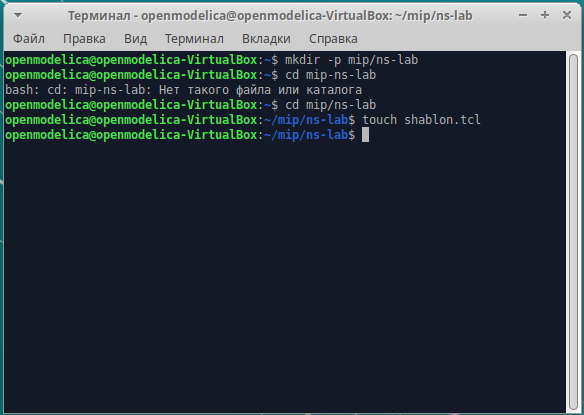{#fig:001 width=90%}

## Первое задание - создание шаблона. Код и работа файла. 

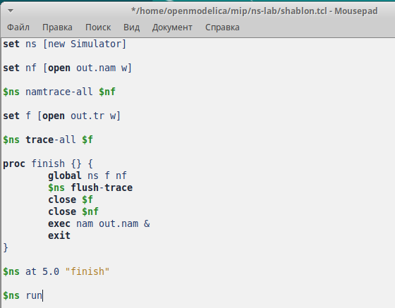{#fig:002 width=49%}
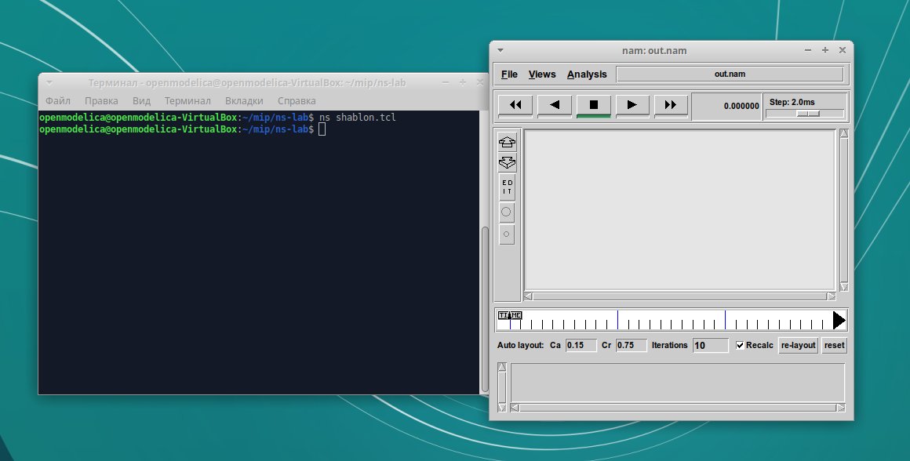{#fig:003 width=49%}

## Второе задание - простейший пример тополгии сети. Код и работа файла.

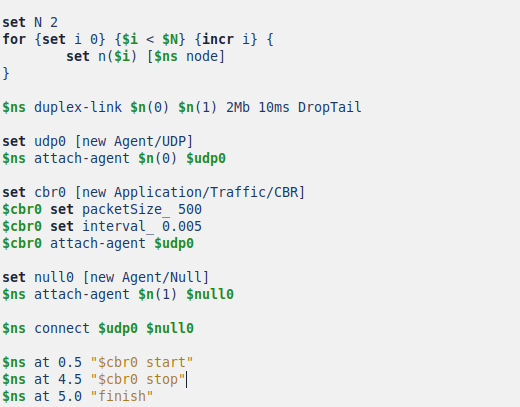{#fig:004 width=49%}
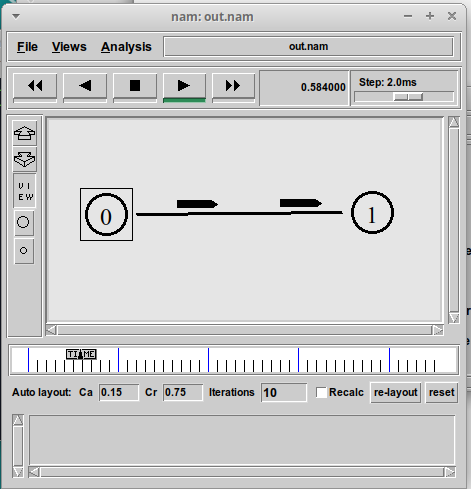{#fig:005 width=49%}

## Третье задание - усложненный пример тополгии сети. Код и работа файла.

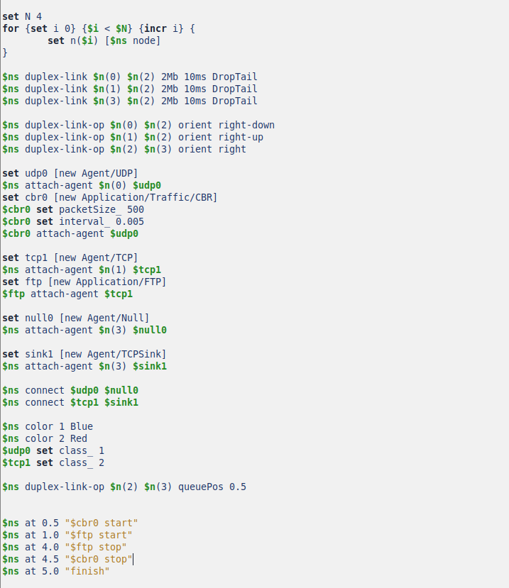{#fig:006 width=49%}
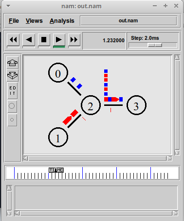{#fig:007 width=49%}

## Четвертое задание - кольцевая топология. Код задания.

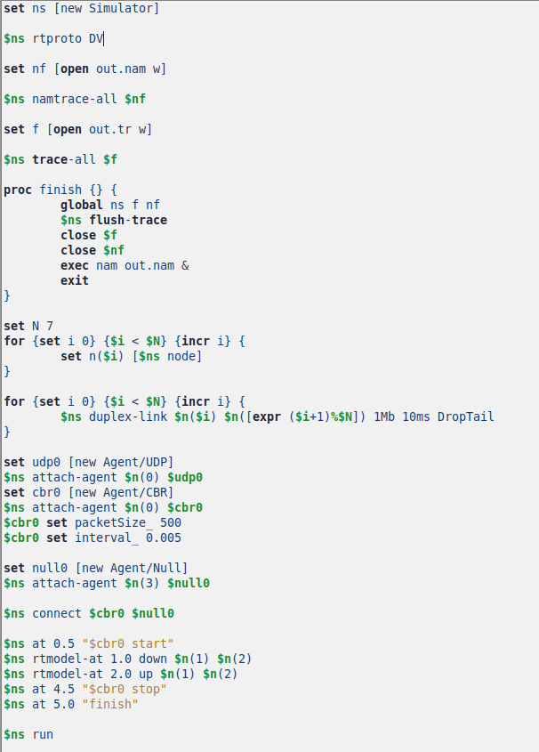{#fig:008 width=90%}

## Четвертое задание - кольцевая топология. Работа файла.

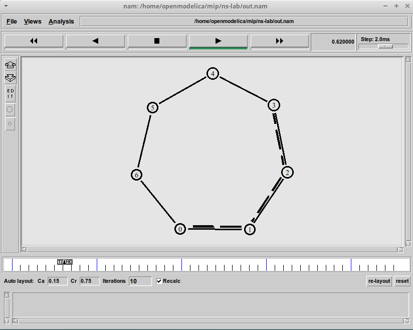{#fig:009 width=49%}
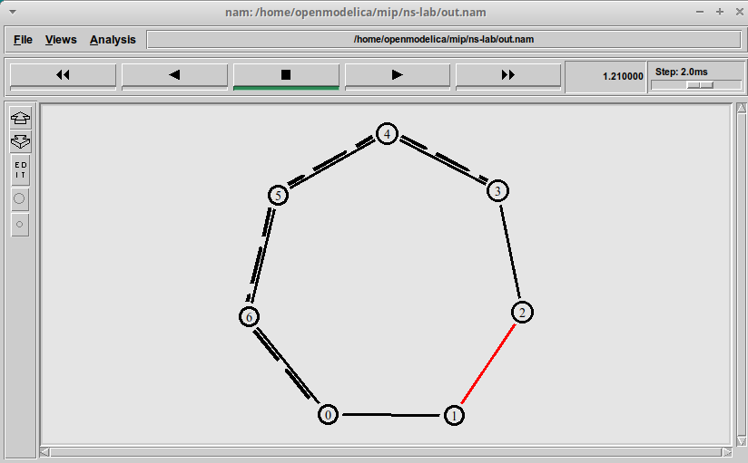{#fig:010 width=49%}

## Упражнение. Изменение кольцевой топологии. Код и работа файла.

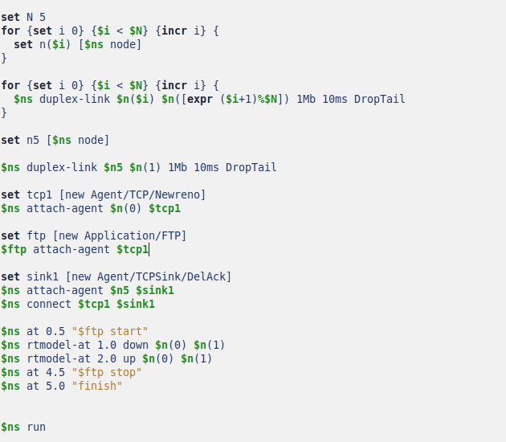{#fig:011 width=49%}
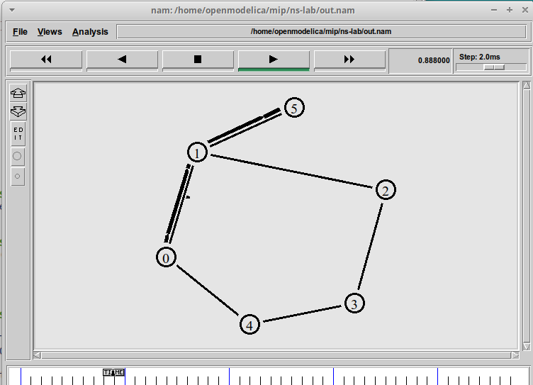{#fig:012 width=49%}

## Выводы

В ходе выполнения лабораторной работы я научился создавать простые примеры топологий сети. Я написал шаблон для реализации следующих заданий. Затем с помощью него создал простейшую топологию, более сложную и кольцевую, а так же самостоятельно выполнил упражнение.
