---
## Front matter
title: "Лабораторная работа №1"
subtitle: "Имитационное моделирование"
author: "Волгин Иван Алексеевич"

## Generic otions
lang: ru-RU
toc-title: "Содержание"

## Bibliography
bibliography: bib/cite.bib
csl: pandoc/csl/gost-r-7-0-5-2008-numeric.csl

## Pdf output format
toc: true # Table of contents
toc-depth: 2
lof: true # List of figures
lot: true # List of tables
fontsize: 12pt
linestretch: 1.5
papersize: a4
documentclass: scrreprt
## I18n polyglossia
polyglossia-lang:
  name: russian
  options:
	- spelling=modern
	- babelshorthands=true
polyglossia-otherlangs:
  name: english
## I18n babel
babel-lang: russian
babel-otherlangs: english
## Fonts
mainfont: IBM Plex Serif
romanfont: IBM Plex Serif
sansfont: IBM Plex Sans
monofont: IBM Plex Mono
mathfont: STIX Two Math
mainfontoptions: Ligatures=Common,Ligatures=TeX,Scale=0.94
romanfontoptions: Ligatures=Common,Ligatures=TeX,Scale=0.94
sansfontoptions: Ligatures=Common,Ligatures=TeX,Scale=MatchLowercase,Scale=0.94
monofontoptions: Scale=MatchLowercase,Scale=0.94,FakeStretch=0.9
mathfontoptions:
## Biblatex
biblatex: true
biblio-style: "gost-numeric"
biblatexoptions:
  - parentracker=true
  - backend=biber
  - hyperref=auto
  - language=auto
  - autolang=other*
  - citestyle=gost-numeric
## Pandoc-crossref LaTeX customization
figureTitle: "Рис."
tableTitle: "Таблица"
listingTitle: "Листинг"
lofTitle: "Список иллюстраций"
lotTitle: "Список таблиц"
lolTitle: "Листинги"
## Misc options
indent: true
header-includes:
  - \usepackage{indentfirst}
  - \usepackage{float} # keep figures where there are in the text
  - \floatplacement{figure}{H} # keep figures where there are in the text
---

# Цель работы

Приобретение навыков моделирования сетей передачи данных с помощью сред-
ства имитационного моделирования NS-2, а также анализ полученных результатов
моделирования.

# Задание

1. Создать шаблом сценария для NS-2
2. Создать простой пример описания топологии сети, состоящей из двух узлов и одного соединения.
3. Создать пример усложненной топологической сети.
4. Создать пример кольцевой топологической сети
5. Самостоятельно изменить кольцевую топологическую сеть выполнив дополнительное упражнение.

# Выполнение лабораторной работы

1. Для начала в своем рабочем каталоге я создал директорию mip, в ней создал еще одну директорию lab-ns, а в ней файл шаблона описания топологии сети (рис. [-@fig:001]).

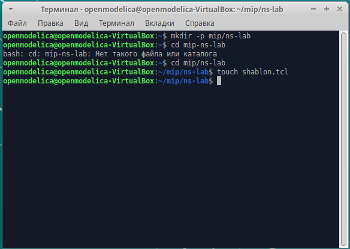{#fig:001 width=70%}

2. Далее я написал код шаблона для описания топологии сети (рис. [-@fig:002])

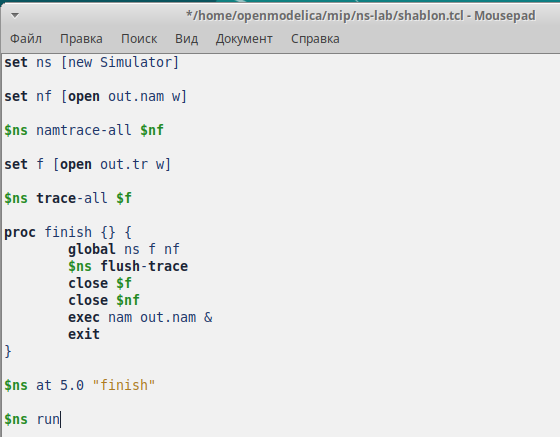{#fig:002 width=70%}

3. После этого я запустил файл shablon.tcl и посмотрел корректность его компиляции (рис. [-@fig:003]).

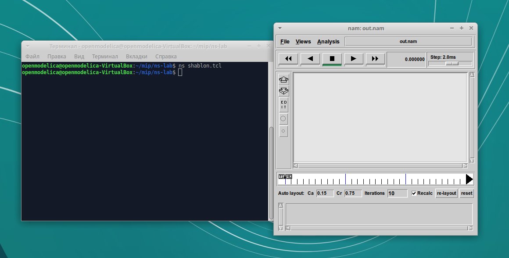{#fig:003 width=70%}

4. Затем я приступил к выполнению второй задачи, где нужно было создать простой пример топологии сети. Постановка задачи: Требуется смоделировать сеть передачи данных, состоящую из двух узлов, соединённых дуплексной линией связи с полосой пропускания 2 Мб/с и задержкой 10 мс, очередью с обслуживанием типа DropTail. От одного узла к другому по протоколу UDP осуществляется передача пакетов, размером 500 байт, с постоянной скоростью 200 пакетов в секунду. 
Чтобы выполнить задание, я скопировал файл шаблона в новый файл example1.tcl и дописал до строки $ns at 5.0 "finish" код реализации задания (рис. [-@fig:004]).
Затем я скомпилировал файл и посмотрел результат (рис. [-@fig:005]) 

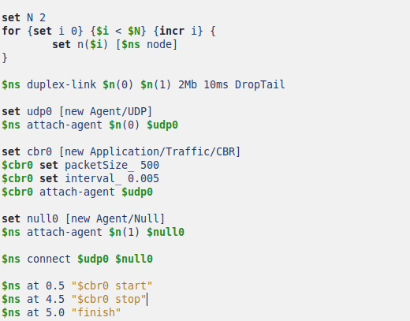{#fig:004 width=70%}

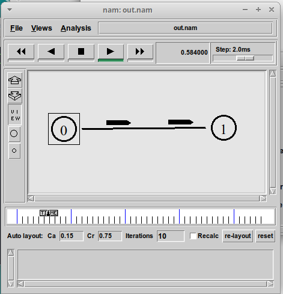{#fig:005 width=70%}

5. Далее я приступил к выполнению третьего задания, где нужно было усложнить пример топологии сети. Точная постановка задачи звучит так. 
– сеть состоит из 4 узлов (n0, n1, n2, n3);
– между узлами n0 и n2, n1 и n2 установлено дуплексное соединение с пропускной способностью 2 Мбит/с и задержкой 10 мс;
– между узлами n2 и n3 установлено дуплексное соединение с пропускной способностью 1,7 Мбит/с и задержкой 20 мс;
– каждый узел использует очередь с дисциплиной DropTail для накопления пакетов, максимальный размер которой составляет 10;
– TCP-источник на узле n0 подключается к TCP-приёмнику на узле n3
(по-умолчанию, максимальный размер пакета, который TCP-агент может генерировать, равняется 1KByte)
– TCP-приёмник генерирует и отправляет ACK пакеты отправителю и откидывает полученные пакеты;
– UDP-агент, который подсоединён к узлу n1, подключён к null-агенту на узле n3;
– генераторы трафика ftp и cbr прикреплены к TCP и UDP агентам соответственно;
– генератор cbr генерирует пакеты размером 1 Кбайт со скоростью 1 Мбит/с;
– работа cbr начинается в 0,1 секунду и прекращается в 4,5 секунды, а ftp начинает работать в 1,0 секунду и прекращает в 4,0 секунды.

Я снова скопировал файл шаблона в новый файл example2.tcl и написал реализацию задания (рис. [-@fig:006]). Затем я скомпилировал код и посмотрел корректность выполнения (рис. [-@fig:007])

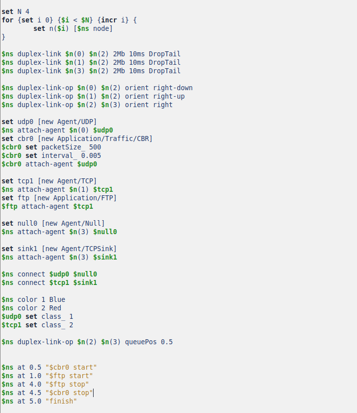{#fig:006 width=70%}

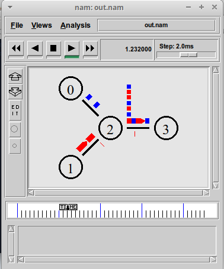{#fig:007 width=70%}

6. Следующим заданием было написание примера кольцевой топологии сети. Постановка задачи:
– сеть состоит из 7 узлов, соединённых в кольцо;
– данные передаются от узла n(0) к узлу n(3) по кратчайшему пути;
– с 1 по 2 секунду модельного времени происходит разрыв соединения между узлами n(1) и n(2);
– при разрыве соединения маршрут передачи данных должен измениться на резервный.

Я создал example3.tcl на основе файла шаблона и далее написал реализацию задания (рис. [-@fig:008]). Затем я скомпилировал файл и посмотрел результаты. Все получилось, сначала сеть работала по одному маршруту (рис. [-@fig:009]) и после разрыва одного соединения трафик пошел по дургому пути (рис. [-@fig:010])

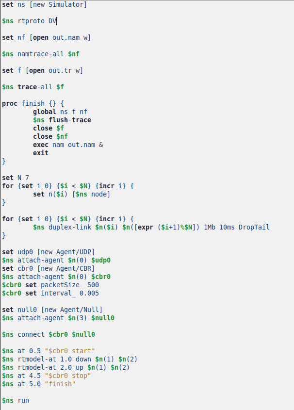{#fig:008 width=70%}

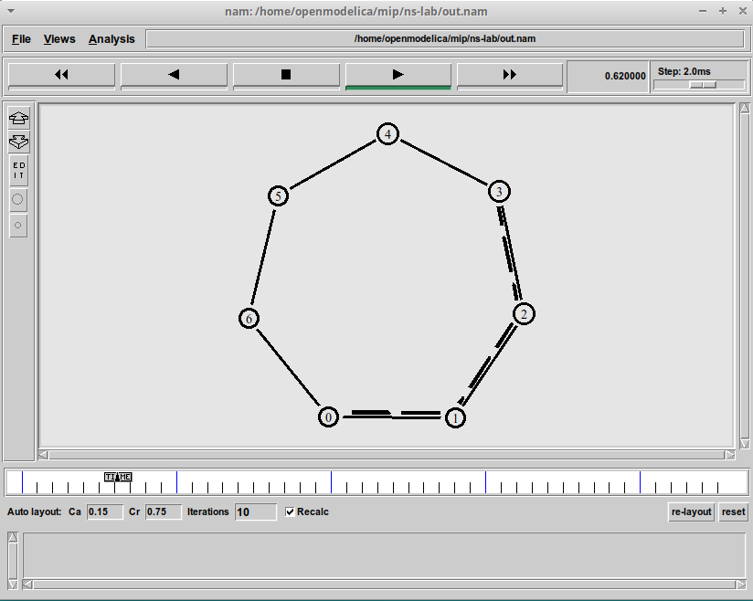{#fig:009 width=70%}

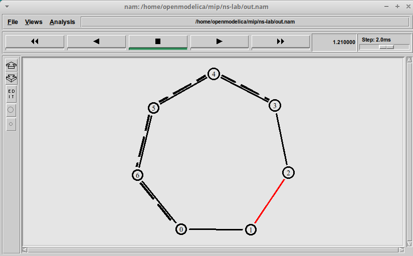{#fig:010 width=70%}

7. Затем я приступил к выполнению упражнения, которое заключалось в том, чтобы переписать код четвертого задания для изменения примера топологии сети. Постановка задачи.
– передача данных должна осуществляться от узла n(0) до узла n(5) по кратчайшему пути в течение 5 секунд модельного времени;
– передача данных должна идти по протоколу TCP (тип Newreno), на принимающей стороне используется TCPSink-объект типа DelAck; поверх TCP работает протокол FTP с 0,5 до 4,5 секунд модельного времени;
– с 1 по 2 секунду модельного времени происходит разрыв соединения между узлами n(0) и n(1);
– при разрыве соединения маршрут передачи данных должен измениться на резервный, после восстановления соединения пакеты снова должны пойти по кратчайшему пути.
Я написал код для реализации упражнения (рис. [-@fig:011]), затем я его скомпилировал и получил удовлетворительный результат (рис. [-@fig:012]).

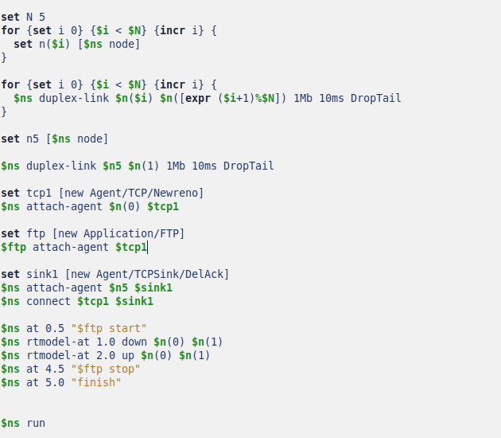{#fig:011 width=70%}

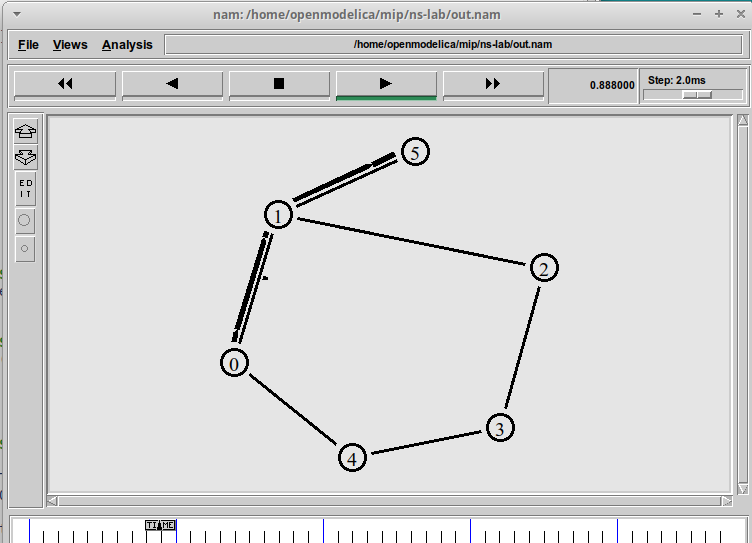{#fig:012 width=70%}

# Выводы

В ходе выполнения лабораторной работы я научился создавать простые примеры топологий сети. Я написал шаблон для реализации следующих заданий. Затем с помощью него создал простейшую топологию, более сложную и кольцевую, а так же самостоятельно выполнил упражнение.  
