---
## Front matter
lang: ru-RU
title: Лабораторная работа №2
subtitle: Имитационное моделирование
author:
  - Волгин И.А.
institute:
  - Российский университет дружбы народов, Москва, Россия
date: 20 февраля 2025

## i18n babel
babel-lang: russian
babel-otherlangs: english

## Formatting pdf
toc: false
toc-title: Содержание
slide_level: 2
aspectratio: 169
section-titles: true
theme: metropolis
header-includes:
 - \metroset{progressbar=frametitle,sectionpage=progressbar,numbering=fraction}
---

# Информация

## Докладчик

:::::::::::::: {.columns align=center}
::: {.column width="90%"}

  * Волгин Иван Алексеевич
  * Студент группы НФИбд-01-22 
  * Российский университет дружбы народов

:::
::::::::::::::

# Выполнение лабораторной работы

## Цели и задачи

Целью работы является исследовать протокл TCP и алгоритм управления очередью RED.

## Задание

- Создать пример сети с дисциплиной RED
- Выполнить дополнительное упражнение

## Код для модели сети из задания 1

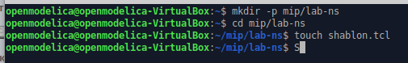{#fig:001 width=95%}

## Графики размер окна и размера очереди

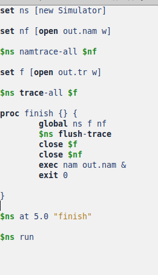{#fig:002 width=45%}
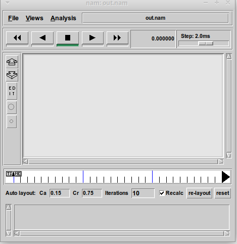{#fig:003 width=45%}

## Изменение типа TCP на Newreno

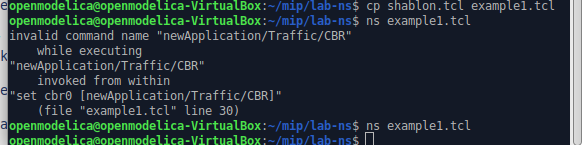{#fig:004 width=95%}

## Графики рамера окна и размера очереди с типом TCP Newreno 

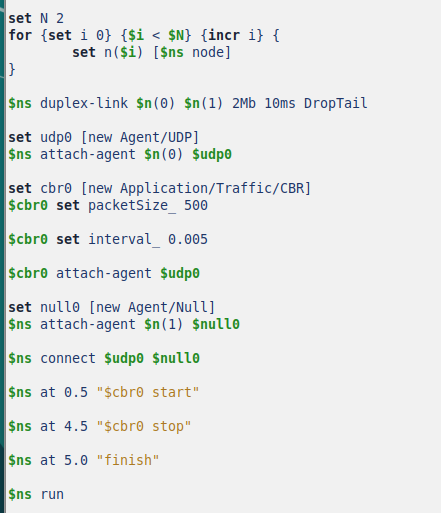{#fig:005 width=45%}
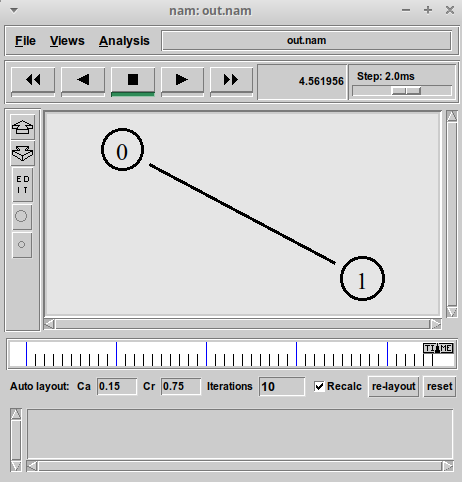{#fig:006 width=45%}

## Изменение типа TCP на Vegas

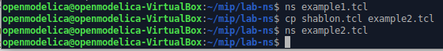{#fig:007 width=95%}

## Графики рамера окна и размера очереди с типом TCP Vegas

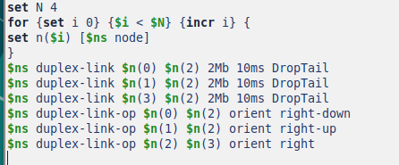{#fig:008 width=45%}
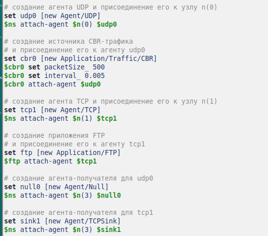{#fig:009 width=45%}

## Код для изменения оформления

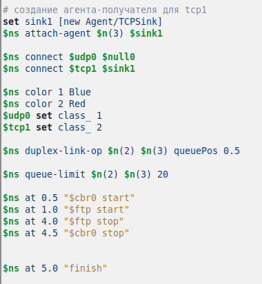{#fig:010 width=95%}

## Графики рамера окна и размера очереди с новым оформлением

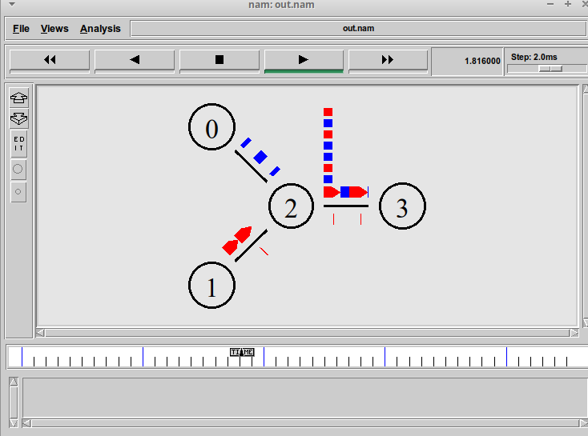{#fig:011 width=45%}
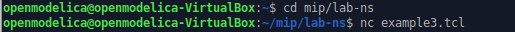{#fig:012 width=45%} 

## Выводы

В ходе выполнения лабораторной работы я исследовал прокол TCP и алгоритм управления очередью RED
