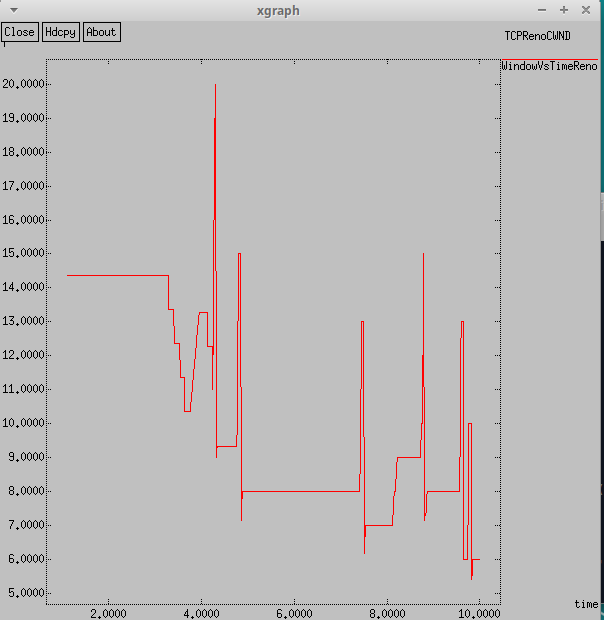

---
## Front matter
title: "Лабораторная работа №2"
subtitle: "Имитационное моделирование"
author: "Волгин Иван Алексеевич"

## Generic otions
lang: ru-RU
toc-title: "Содержание"

## Bibliography
bibliography: bib/cite.bib
csl: pandoc/csl/gost-r-7-0-5-2008-numeric.csl

## Pdf output format
toc: true # Table of contents
toc-depth: 2
lof: true # List of figures
lot: false # List of tables
fontsize: 12pt
linestretch: 1.5
papersize: a4
documentclass: scrreprt
## I18n polyglossia
polyglossia-lang:
  name: russian
  options:
	- spelling=modern
	- babelshorthands=true
polyglossia-otherlangs:
  name: english
## I18n babel
babel-lang: russian
babel-otherlangs: english
## Fonts
mainfont: IBM Plex Serif
romanfont: IBM Plex Serif
sansfont: IBM Plex Sans
monofont: IBM Plex Mono
mathfont: STIX Two Math
mainfontoptions: Ligatures=Common,Ligatures=TeX,Scale=0.94
romanfontoptions: Ligatures=Common,Ligatures=TeX,Scale=0.94
sansfontoptions: Ligatures=Common,Ligatures=TeX,Scale=MatchLowercase,Scale=0.94
monofontoptions: Scale=MatchLowercase,Scale=0.94,FakeStretch=0.9
mathfontoptions:
## Biblatex
biblatex: true
biblio-style: "gost-numeric"
biblatexoptions:
  - parentracker=true
  - backend=biber
  - hyperref=auto
  - language=auto
  - autolang=other*
  - citestyle=gost-numeric
## Pandoc-crossref LaTeX customization
figureTitle: "Рис."
tableTitle: "Таблица"
listingTitle: "Листинг"
lofTitle: "Список иллюстраций"
lotTitle: "Список таблиц"
lolTitle: "Листинги"
## Misc options
indent: true
header-includes:
  - \usepackage{indentfirst}
  - \usepackage{float} # keep figures where there are in the text
  - \floatplacement{figure}{H} # keep figures where there are in the text
---

# Цель работы

Целью работы является исследовать протокл TCP и алгоритм управления очередью RED.

# Задание

- Создать пример сети с дисциплиной RED
- Выполнить дополнительное упражнение

# Выполнение лабораторной работы

1. В первом задании нужно построить пример сети с дисциплиной RED. Осписание моделируемой сети: 
– сеть состоит из 6 узлов;
– между всеми узлами установлено дуплексное соединение с различными пропускной способностью и задержкой 10 мс
– узел r1 использует очередь с дисциплиной RED для накопления пакетов, максимальный размер которой составляет 25;
– TCP-источники на узлах s1 и s2 подключаются к TCP-приёмнику на узле s3;
– генераторы трафика FTP прикреплены к TCP-агентам.
Для реализации этой модели написал следующий код (рис. [-@fig:001]).

{#fig:001 width=70%}

В итоге получил следующие два графика (рис. [-@fig:002]) (рис. [-@fig:003]). На первом изображен размер окна. Можно заметить, что пиковое значение находится в районе 33, а основной диапазон значений от 1 до 14. На втором графике мы видим размер очереди. Пиковое значение равняется 11, также есть еще пара пиков на значениях 11 и 9, но основной диапазон от 0 до 7.

{#fig:002 width=70%}

{#fig:003 width=70%}

2. Далее я приступил к выполнению дополнительного упражнения. Задачи:
– Измените в модели на узле s1 тип протокола TCP с Reno на NewReno, затем на Vegas. Сравните и поясните результаты.
– Внесите изменения при отображении окон с графиками (измените цвет фона, цвет траекторий, подписи к осям, подпись траектории в легенде).

В первом пункте нужно было сначала изменить тип протокла TCP на Newreno, что я и сделал (рис. [-@fig:004]).

{#fig:004 width=70%}

Получил следующие результаты (рис. [-@fig:005]) (рис. [-@fig:006]). На графике размера окна мы видим, что один пик на значении 33, а затем колебания в диапазоне от 4 до 14. На втором графике, который показывает размер очереди, можно заметить один (в отличии от прошлого Reno) пик на значении 13 и далее однородные колебания в диапазоне 0 - 8.

{#fig:005 width=70%}

{#fig:006 width=70%}

Далее нужно было поменять тип протокола TCP уже на Vegas. В коде это выглядело так (рис. [-@fig:007])

{#fig:007 width=70%}

Я снова получил два графика, которые уже сильно отличаются от двух предыдущих вариантов (рис. [-@fig:008]) (рис. [-@fig:009]). На первом графике мы видим частые краковременные пики и периоды по несколько секунд, когда значение размера окна не менялось. Второй меньше первого визуально отличается от предшественников. Пик также располагается на значении 13, а основной диапазон значений от 0 до 8.

{#fig:008 width=70%}

{#fig:009 width=70%}

Вторым пунктом в упражнении было изменение оформления окон с графиками. Нужно было изменить цвет фона, цвет траекторий, подписи к осям и подпись траектории в легенде. Я внес изменения в код (рис. [-@fig:010]) и получил следующие результаты (рис. [-@fig:011]) (рис. [-@fig:012]).

{#fig:010 width=70%}

{#fig:011 width=70%}

{#fig:012 width=70%}

# Выводы

В ходе выполнения лабораторной работы я исследовал прокол TCP и алгоритм управления очередью RED
