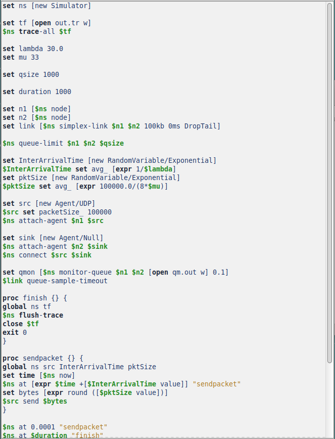
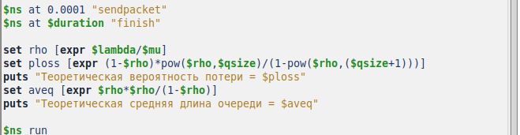
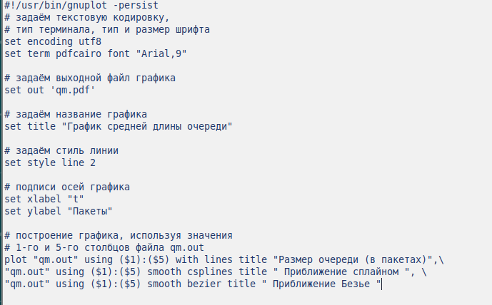
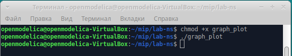
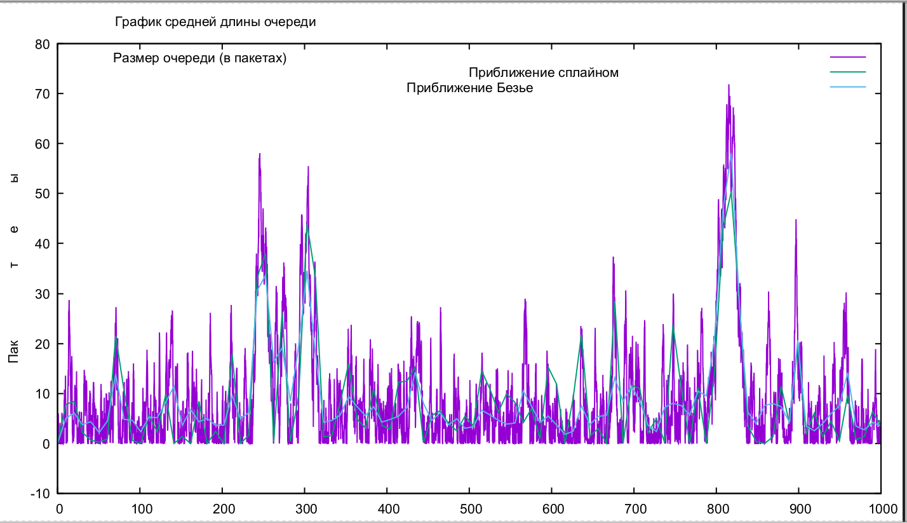

---
## Front matter
lang: ru-RU
title: Лабораторная работа №3
subtitle: Имитационное моделирование
author:
  - Волгин И.А.
institute:
  - Российский университет дружбы народов, Москва, Россия
date: 22 февраля 2025

## i18n babel
babel-lang: russian
babel-otherlangs: english

## Formatting pdf
toc: false
toc-title: Содержание
slide_level: 2
aspectratio: 169
section-titles: true
theme: metropolis
header-includes:
 - \metroset{progressbar=frametitle,sectionpage=progressbar,numbering=fraction}
---

# Информация

## Докладчик

:::::::::::::: {.columns align=center}
::: {.column width="95%"}

  * Волгин Иван Алексеевич
  * Студент группы НФИбд-01-22
  * Российский университет дружбы народов

:::
::::::::::::::

# Выполнение лабораторной работы

## Модель СМО на NS-2.

{#fig:001 width=45%}
{#fig:002 width=45%}

## Результат выполнения кода.

{#fig:003 width=100%}

## Построение графика. Подготовка и код.

{#fig:004 width=45%}
{#fig:005 width=45%}

## Добавление прав файлу и результат построения графика.

{#fig:006 width=45%}
{#fig:007 width=45%}

## Выводы

В ходе выполение лабораторной работы я ознакомился с СМО и сделал несколько практических заданий, что позволило мне лучше понять тему.
