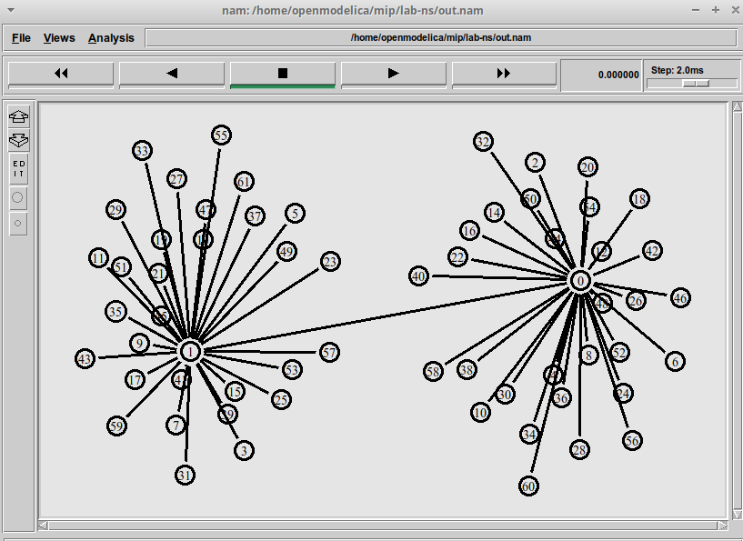
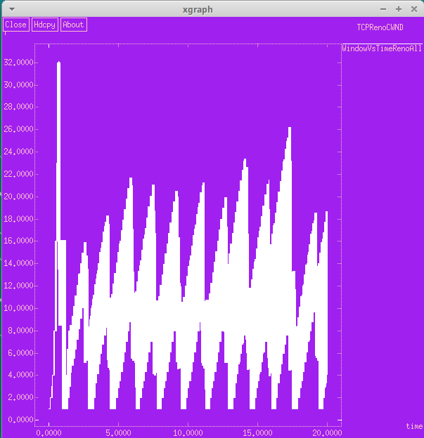
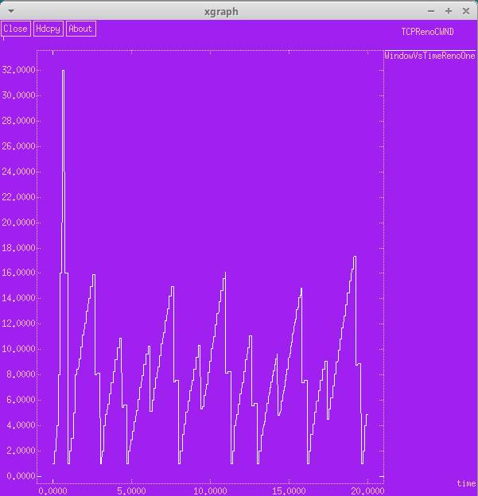
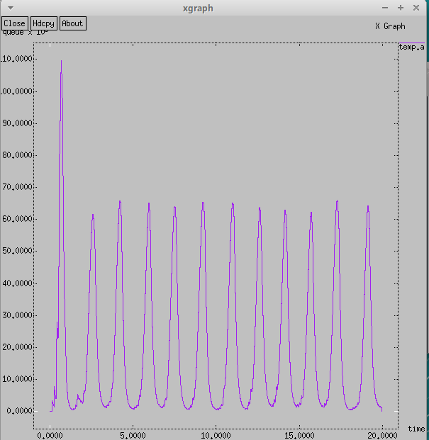
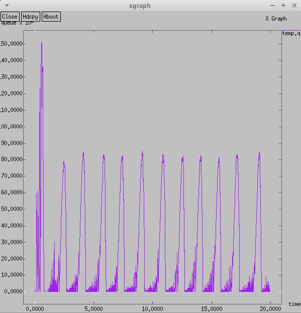
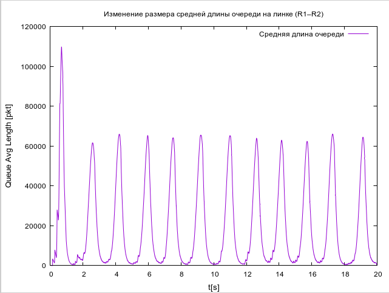
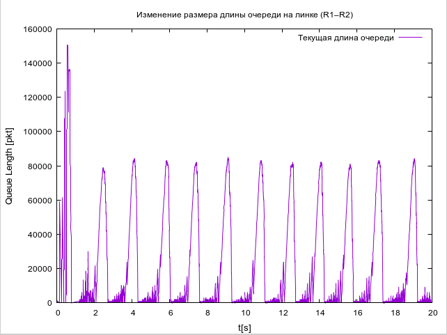
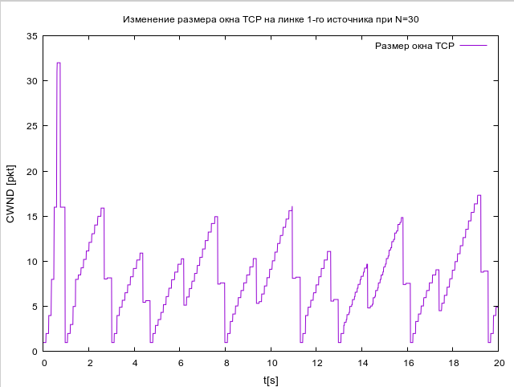
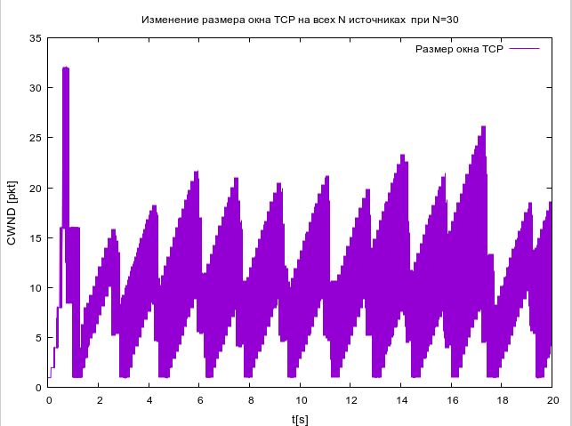

---
## Front matter
lang: ru-RU
title: Лабораторная работа №4
subtitle: Имитационное моделирование
author:
  - Волгин И. А.
institute:
  - Российский университет дружбы народов, Москва, Россия
date: 01 марта 2025

## i18n babel
babel-lang: russian
babel-otherlangs: english

## Formatting pdf
toc: false
toc-title: Содержание
slide_level: 2
aspectratio: 169
section-titles: true
theme: metropolis
header-includes:
 - \metroset{progressbar=frametitle,sectionpage=progressbar,numbering=fraction}
---

# Информация

## Докладчик

:::::::::::::: {.columns align=center}
::: {.column width="95%"}

  * Волгин Иван Алексеевич
  * Студент группы НФИбд-01-22
  * Российский университет дружбы народов

:::
::::::::::::::

# Выполнение работы

## Вид созданной модели сети
{#fig:001 width=95%}

## Размер окна

{#fig:002 width=45%}
{#fig:005 width=45%}

## Средний и текущий размер очереди

{#fig:003 width=45%}
{#fig:004 width=45%}

## Средняя и текущая длина очереди в GNUPlot

{#fig:006 width=45%}
{#fig:007 width=45%}

## Изменеие размера окна TCP на линке 1-го источника и на всех N источниках

{#fig:008 width=45%}
{#fig:009 width=45%}

## Выводы

В ходе этой лабораторной работы я разобрался и построил заданную модель сети, а так же вывел несколько графиков ее характеристик.

