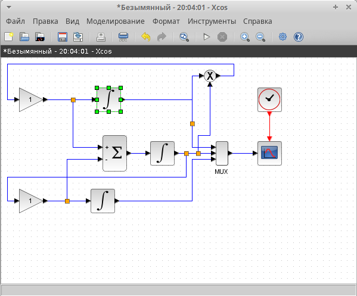
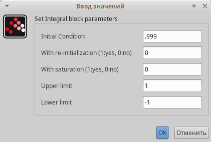
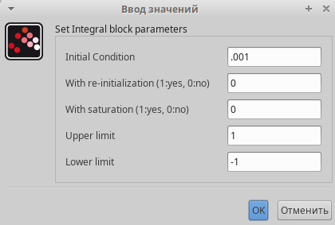
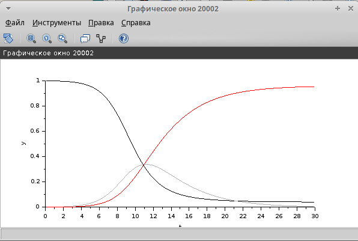
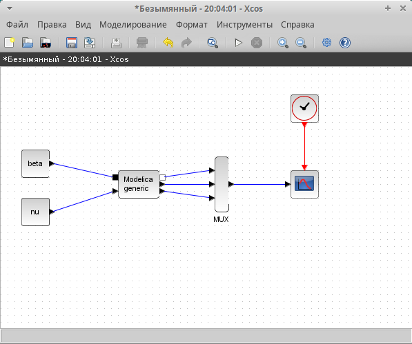
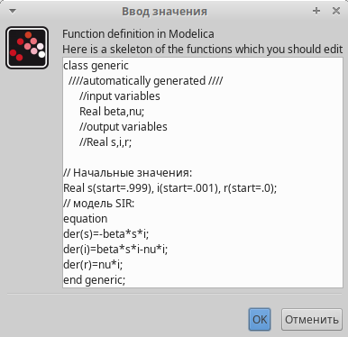
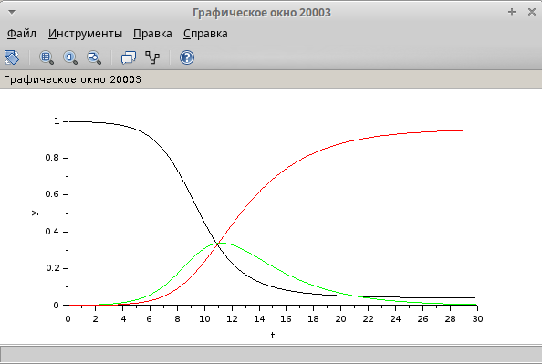
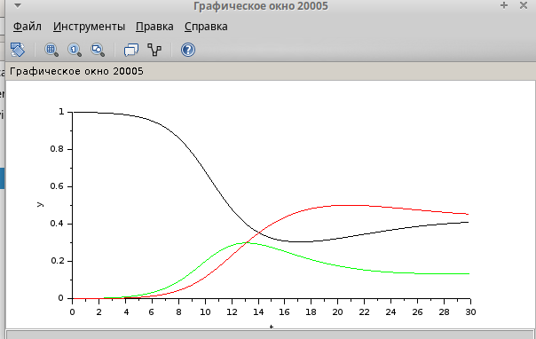

---
## Front matter
lang: ru-RU
title: Лабораторная работа №5
subtitle: Имитационное моделирование
author:
  - Волгин И.А.
institute:
  - Российский университет дружбы народов, Москва, Россия
date: 08 марта 2025

## i18n babel
babel-lang: russian
babel-otherlangs: english

## Formatting pdf
toc: false
toc-title: Содержание
slide_level: 2
aspectratio: 169
section-titles: true
theme: metropolis
header-includes:
 - \metroset{progressbar=frametitle,sectionpage=progressbar,numbering=fraction}
---

# Информация

## Докладчик

:::::::::::::: {.columns align=center}
::: {.column width="70%"}

  * Волгин Иван Алексеевич
  * Студент группы НФИбд-01-22
  * Российский университет дружбы народов

:::
::::::::::::::

# Выполнение работы

## Цель работы

Построить модель SIR в xcos и OpenModelica

## Задание

1. Реализовать модель SIR в xcos
2. Реализовать модель SIR в xcos c помощью блока Modelica
3. Реализовать модель SIR с помощью OpenModelica
4. Выполнить задание для самостоятельного выполнения

## Модель SIR
{#fig:001 width=70%}

## Настройка интегральных блоков

{#fig:002 width=45%}
{#fig:003 width=45%}

## Результат в виде графика

{#fig:004 width=70%}

## Реализация модели SIR с помощью языка Modelica.

{#fig:005 width=45%}
{#fig:006 width=45%}

## Результат

{#fig:007 width=70%}

# Самомтоятельное упражнение

## Строю схему модели SIR с учетом демографических факторов

{#fig:011 width=70%}

## Получаю график

{#fig:012 width=70%}

## Cтрою схему, пользуясь блоком Modelica

{#fig:013 width=70%}

## Параметры блока соответственно новым условиям

{#fig:014 width=45%}
{#fig:015 width=45%}

## График

{#fig:016 width=70%}

## Моделирование с помощью OpenModelica. Код

{#fig:017 width=70%}

## График модели SIR построенный с помощью OpenModelica

{#fig:018 width=70%}

## Выводы

В ходе выполнения данной лабораторной работы я построил модель SIR в xcos и выполнил самостоятельное задание.

