---
## Front matter
title: "Лабораторная раота №5"
subtitle: "Имитационное моделирование"
author: "Волгин Иван Алексеевич"

## Generic otions
lang: ru-RU
toc-title: "Содержание"

## Bibliography
bibliography: bib/cite.bib
csl: pandoc/csl/gost-r-7-0-5-2008-numeric.csl

## Pdf output format
toc: true # Table of contents
toc-depth: 2
lof: true # List of figures
lot: false # List of tables
fontsize: 12pt
linestretch: 1.5
papersize: a4
documentclass: scrreprt
## I18n polyglossia
polyglossia-lang:
  name: russian
  options:
	- spelling=modern
	- babelshorthands=true
polyglossia-otherlangs:
  name: english
## I18n babel
babel-lang: russian
babel-otherlangs: english
## Fonts
mainfont: IBM Plex Serif
romanfont: IBM Plex Serif
sansfont: IBM Plex Sans
monofont: IBM Plex Mono
mathfont: STIX Two Math
mainfontoptions: Ligatures=Common,Ligatures=TeX,Scale=0.94
romanfontoptions: Ligatures=Common,Ligatures=TeX,Scale=0.94
sansfontoptions: Ligatures=Common,Ligatures=TeX,Scale=MatchLowercase,Scale=0.94
monofontoptions: Scale=MatchLowercase,Scale=0.94,FakeStretch=0.9
mathfontoptions:
## Biblatex
biblatex: true
biblio-style: "gost-numeric"
biblatexoptions:
  - parentracker=true
  - backend=biber
  - hyperref=auto
  - language=auto
  - autolang=other*
  - citestyle=gost-numeric
## Pandoc-crossref LaTeX customization
figureTitle: "Рис."
tableTitle: "Таблица"
listingTitle: "Листинг"
lofTitle: "Список иллюстраций"
lotTitle: "Список таблиц"
lolTitle: "Листинги"
## Misc options
indent: true
header-includes:
  - \usepackage{indentfirst}
  - \usepackage{float} # keep figures where there are in the text
  - \floatplacement{figure}{H} # keep figures where there are in the text
---

# Цель работы

Построить модель SIR в xcos и OpenModelica

# Задание

1. Реализовать модель SIR в xcos
2. Реализовать модель SIR в xcos c помощью блока Modelica
3. Реализовать модель SIR с помощью OpenModelica
4. Выполнить задание для самостоятельного выполнения

# Теоретическое введение

Модель SIR предложена в 1927 г. (W. O. Kermack, A. G. McKendrick). С описанием
модели можно ознакомиться, например в [1].
Предполагается, что особи популяции размера N могут находиться в трёх различ-
ных состояниях:
– S (susceptible, уязвимые) — здоровые особи, которые находятся в группе риска
и могут подхватить инфекцию;
– I (infective, заражённые, распространяющие заболевание) — заразившиеся пере-
носчики болезни;
– R (recovered/removed, вылечившиеся) — те, кто выздоровел и перестал распро-
странять болезнь (в эту категорию относят, например, приобретших иммунитет
или умерших).

# Выполнение лабораторной работы

В ходе данной лабораторной работы нам нужно было реализовать модель SIR. Так я ее построил в xcos (рис. [-@fig:001]).

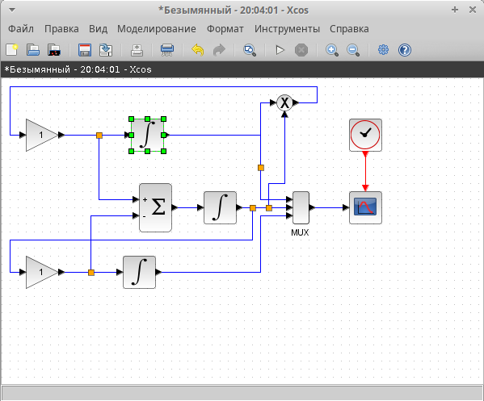{#fig:001 width=70%}

Далее нужно было настроить интегральные блоки. В ерхнем и среднем я ввел значения 0.999 и 0.001 соответственно (рис. [-@fig:002]) (рис. [-@fig:003])

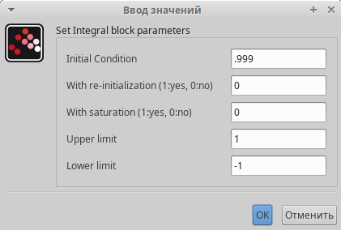{#fig:002 width=70%}

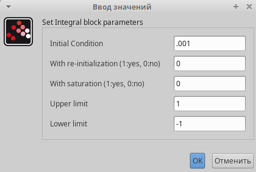{#fig:003 width=70%}

Затем я запустил модель  и получил результат в виде графика (рис. [-@fig:004]).

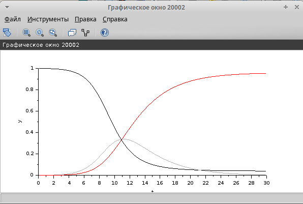{#fig:004 width=70%}

Далее нужно было реализовать модель SIR с помощью языка Modelica. Я подготовил модель в xcos (рис. [-@fig:005]) и написал необходимый код на Modelica (рис. [-@fig:006])

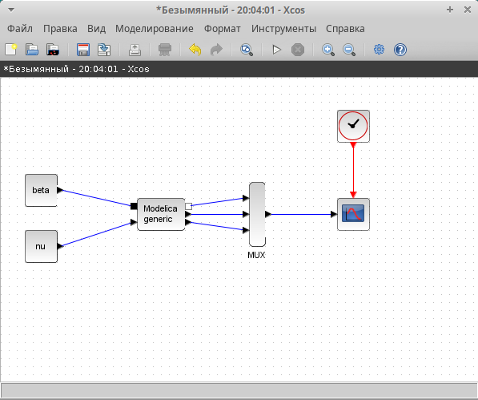{#fig:005 width=70%}

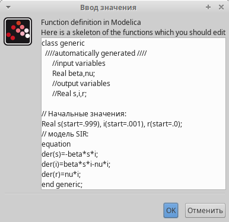{#fig:006 width=70%}

Затем я запустил модель и получил, как результат, следующий график (рис. [-@fig:007]).

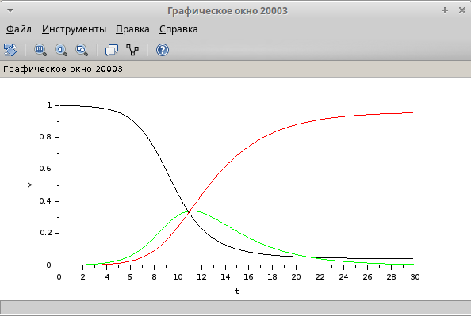{#fig:007 width=70%}

Теперь делаю упражнение для самостоятельного выполнения, строю схожую модель, но с учетом демографических факторов. Добавляю параметр мю = 0,1. 

Строю схему (рис. [-@fig:008]).

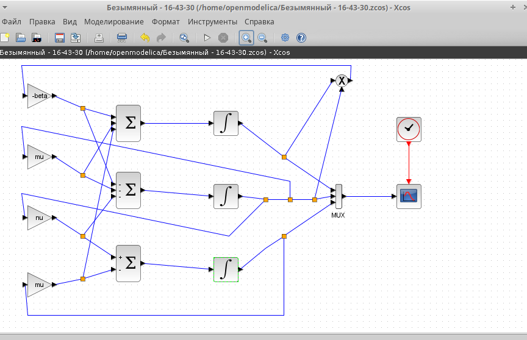{#fig:011 width=70%}

Получаю график (рис. [-@fig:009]).

{#fig:012 width=70%}

Теперь строю схему, пользуясь блоком Modelica (рис. [-@fig:010]).

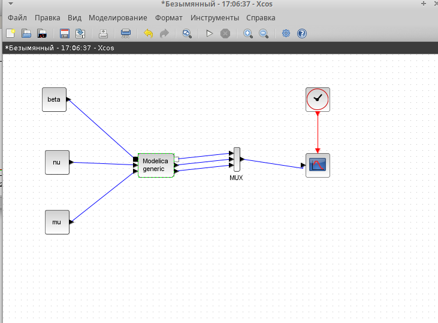{#fig:013 width=70%}

Параметры блока меняю соответственно новым условиям (рис. [-@fig:011]), (рис. [-@fig:012]). 

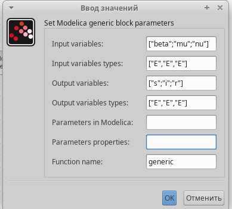{#fig:014 width=70%}

{#fig:015 width=70%}

Получаю график (рис. [-@fig:013]).

{#fig:016 width=70%}

Теперь приступаю к моделированию с помощью OpenModelica для чего пишу такой код (рис. [-@fig:014]).

{#fig:017 width=70%}

Получаю график модели SIR построенный с помощью OpenModelica (рис. [-@fig:015]).

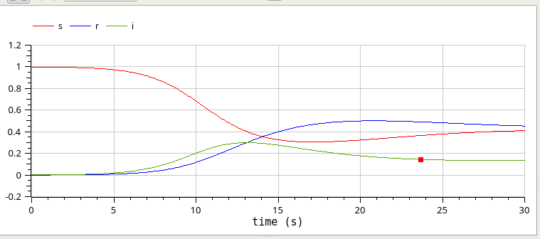{#fig:018 width=70%}

# Выводы

В ходе выполнения данной лабораторной работы я построил модель SIR в xcos и выполнил самостоятельное задание.

