---
## Front matter
lang: ru-RU
title: Лабораторная работа №6 
subtitle: Имитационное моделирование
author:
  - Волгин И. А.
institute:
  - Российский университет дружбы народов, Москва, Россия
date: 14 марта 2025

## i18n babel
babel-lang: russian
babel-otherlangs: english

## Formatting pdf
toc: false
toc-title: Содержание
slide_level: 2
aspectratio: 169
section-titles: true
theme: metropolis
header-includes:
 - \metroset{progressbar=frametitle,sectionpage=progressbar,numbering=fraction}
---

# Информация

## Докладчик

:::::::::::::: {.columns align=center}
::: {.column width="99%"}

  * Волгин Иван Алексеевич
  * Студент группы НФИбд-01-22
  * Российский университет дружбы народов

:::
::::::::::::::

## Цель работы

Изучить модель хищник-жертва и реализовать ее в Scilab и OpenModelica.

## Задание

1. Реализовать модель xcos
2. Релизовать модель c помощью блока Modelica в xocs
3. Реализовать модель в OpenModelica

# Выполнение лабораторной работы

# Реализация модели в xcos

## Переменные окружения
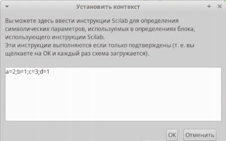{#fig:001 width=99%}

## Начальные значения в блоках интегрирования

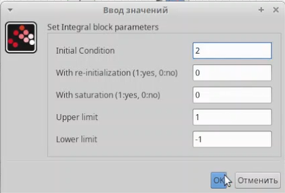{#fig:002 width=45%}
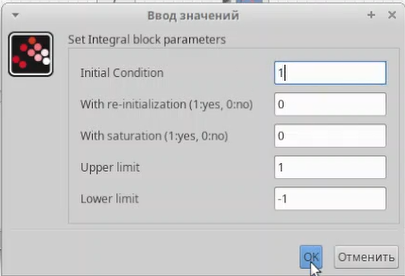{#fig:003 width=45%}

## Конечное время моделирования

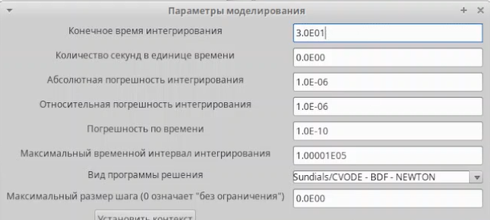{#fig:004 width=99%}

## Готовая модель хищник-жертва

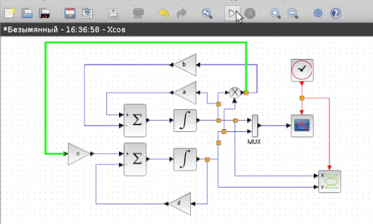{#fig:005 width=99%}

## Результаты построения модели

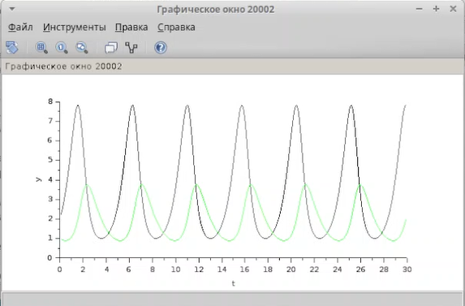{#fig:006 width=45%}
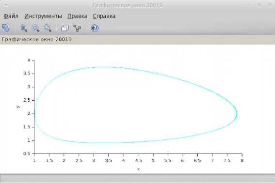{#fig:007 width=45%}

# Реализация модели с помощью блока Modelica

## Параметры блока Modelica

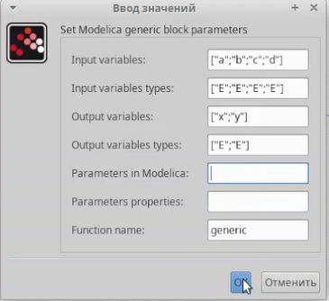{#fig:008 width=99%}

## Код реализации модели на языке Modelica

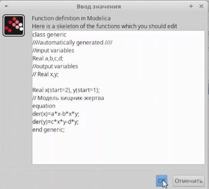{#fig:009 width=99%}

## Модель хищник-жертва с использованием блока Modelica

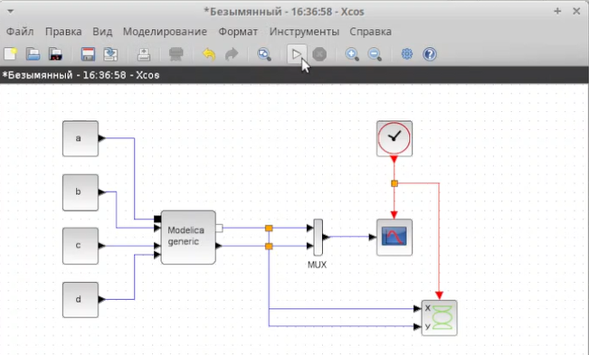{#fig:010 width=99%}

## Результаты построения модели

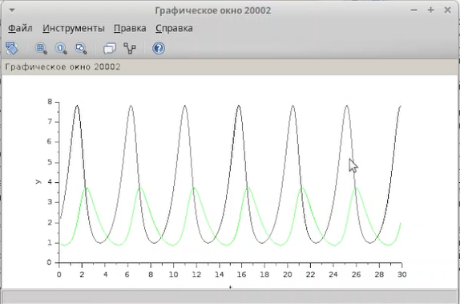{#fig:011 width=45%}
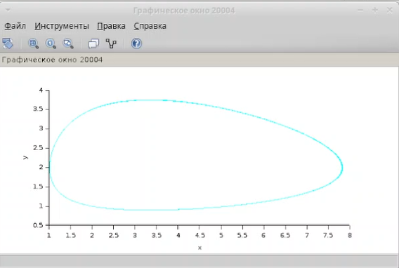{#fig:012 width=45%}

# Реализация модели хищник-жертва в OpenModelica

## Код реализации модели в OpenModelica

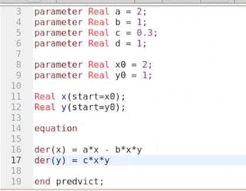{#fig:013 width=99%}

## Результаты построения модели

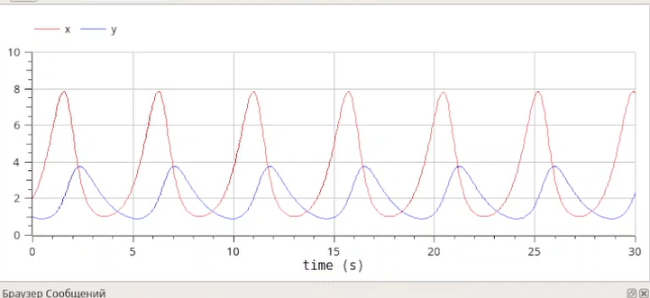{#fig:014 width=45%}
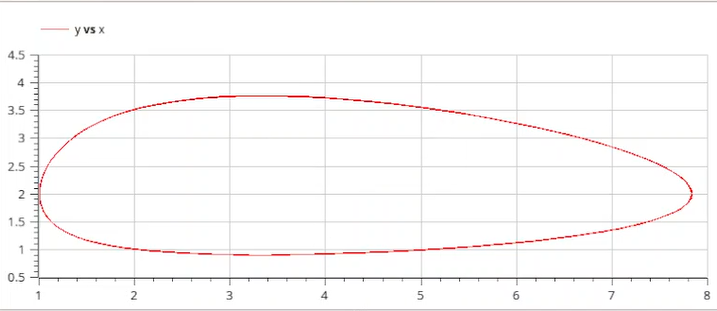{#fig:015 width=45%}

## Выводы

В ходе выполнения лабораторной работы я изучил и реализовал тремя разными способами модель хищник-жертва.
