---
## Front matter
title: "Лабораторная работа №6"
subtitle: "Имитационное моделирование"
author: "Волгин Иван Алексеевич"

## Generic otions
lang: ru-RU
toc-title: "Содержание"

## Bibliography
bibliography: bib/cite.bib
csl: pandoc/csl/gost-r-7-0-5-2008-numeric.csl

## Pdf output format
toc: true # Table of contents
toc-depth: 2
lof: true # List of figures
lot: false # List of tables
fontsize: 12pt
linestretch: 1.5
papersize: a4
documentclass: scrreprt
## I18n polyglossia
polyglossia-lang:
  name: russian
  options:
	- spelling=modern
	- babelshorthands=true
polyglossia-otherlangs:
  name: english
## I18n babel
babel-lang: russian
babel-otherlangs: english
## Fonts
mainfont: IBM Plex Serif
romanfont: IBM Plex Serif
sansfont: IBM Plex Sans
monofont: IBM Plex Mono
mathfont: STIX Two Math
mainfontoptions: Ligatures=Common,Ligatures=TeX,Scale=0.94
romanfontoptions: Ligatures=Common,Ligatures=TeX,Scale=0.94
sansfontoptions: Ligatures=Common,Ligatures=TeX,Scale=MatchLowercase,Scale=0.94
monofontoptions: Scale=MatchLowercase,Scale=0.94,FakeStretch=0.9
mathfontoptions:
## Biblatex
biblatex: true
biblio-style: "gost-numeric"
biblatexoptions:
  - parentracker=true
  - backend=biber
  - hyperref=auto
  - language=auto
  - autolang=other*
  - citestyle=gost-numeric
## Pandoc-crossref LaTeX customization
figureTitle: "Рис."
tableTitle: "Таблица"
listingTitle: "Листинг"
lofTitle: "Список иллюстраций"
lotTitle: "Список таблиц"
lolTitle: "Листинги"
## Misc options
indent: true
header-includes:
  - \usepackage{indentfirst}
  - \usepackage{float} # keep figures where there are in the text
  - \floatplacement{figure}{H} # keep figures where there are in the text
---

# Цель работы

Изучить модель хищник-жертва и реализовать ее в Scilab и OpenModelica.

# Задание

1. Реализовать модель xcos
2. Релизовать модель c помощью блока Modelica в xocs
3. Реализовать модель в OpenModelica

# Выполнение лабораторной работы

1. Для реализации модели в xcos беру блоки CLOCK_c, CSCOPE, TEXT_f, MUX, INTEGRAL_m, GAINBLK_f, SUMMATION, PROD_f, CSCOPXY, а также задаю переменные окружения a, b, c, d. (рис. [-@fig:001]).

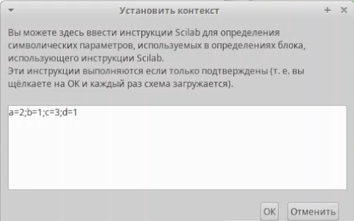{#fig:001 width=70%}

Далее задаю параметры блоков интегрирования x(0) = 2 (рис. [-@fig:002]), y(0) = 1 (рис. [-@fig:003])

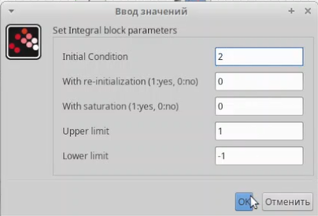{#fig:002 width=70%}

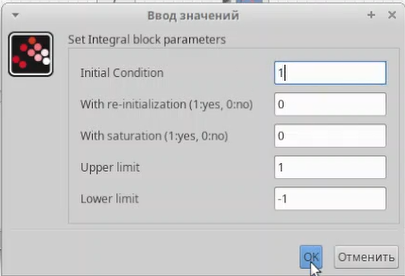{#fig:003 width=70%}

После этого нужно было задать конечное время интегрирования в параметрах моделирования (рис. [-@fig:004]) и затем можно было приступать к построению модели. Готовую модель можно увидеть на (рис. [-@fig:005])

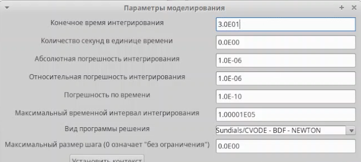{#fig:004 width=70%}

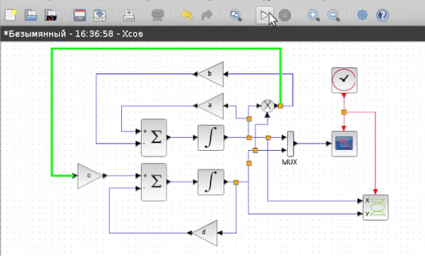{#fig:005 width=70%}

Далее запускаем компиляцию модели и получаем результаты в виде динамики изменения численности хищников и жертв модели (рис. [-@fig:006]) и фазового портрета модели (рис. [-@fig:007])

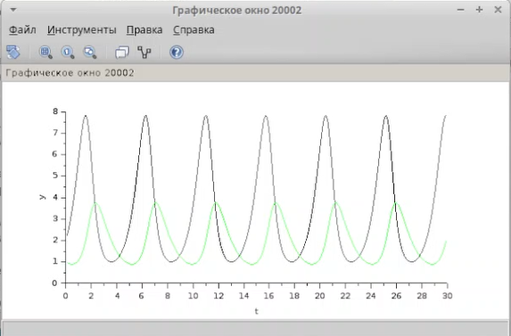{#fig:006 width=70%}

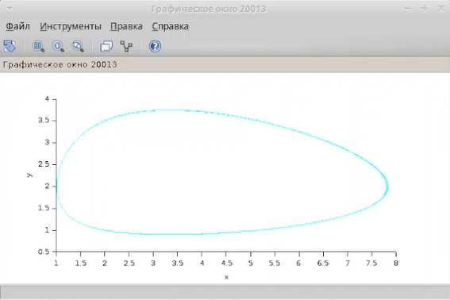{#fig:007 width=70%}

2. Приступаю к выполнению второго задания - построения модел хищник-жертва с помощью блока Modelica в xcos. Для этого я переделал модель из прошлого задания, удалив все блоки кроме MUX, CSCOPE, CLOCK_c и CSCOPXY и добавив блоки MOdelica и 4 блока констант для переменных окружения. Далее настроил параметры блока Modelica (рис. [-@fig:008]) и написал код реализации модели на языке Modelica (рис. [-@fig:009])

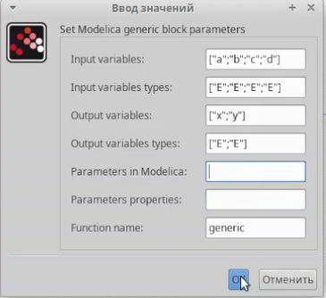{#fig:008 width=70%}

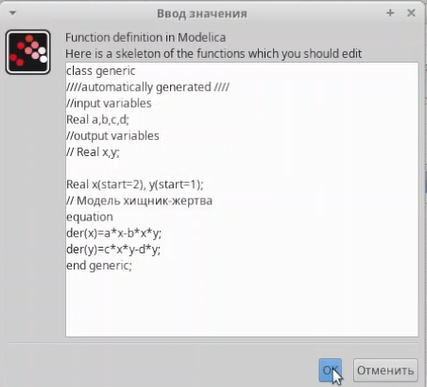{#fig:009 width=70%}

Далее соединил все все блоки и получил готовую модель хищник-жертва (рис. [-@fig:010])

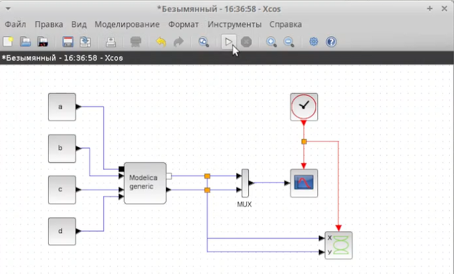{#fig:010 width=70%}

После этого я запустил компиляцию модели и получил результаты полностью совпадающие с результатами первой модели (рис. [-@fig:011]) (рис. [-@fig:012])

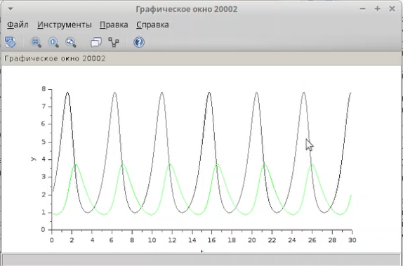{#fig:011 width=70%}

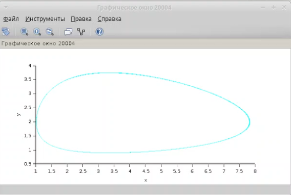{#fig:012 width=70%}

3. Третьим заданием была реализация модели хищник-жертва в OpenModelica. Я написал код реализации модели (рис. [-@fig:013]) и после его компиляции получил результаты совпадающие с результатми двух предыдущих заданий (рис. [-@fig:014]) (рис. [-@fig:015])

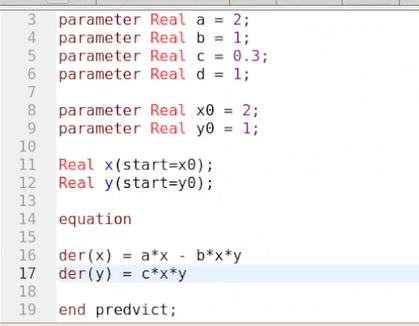{#fig:013 width=70%}

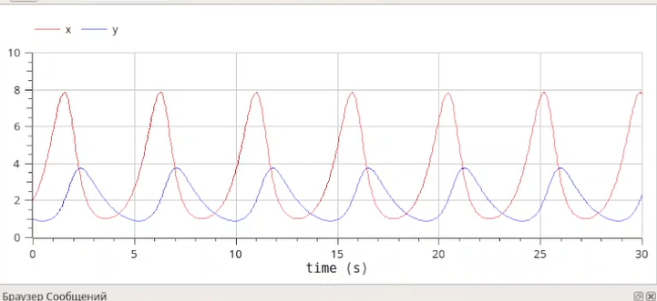{#fig:014 width=70%}

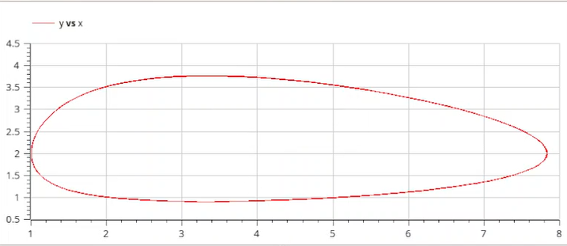{#fig:015 width=70%}

# Выводы

В ходе выполнения лабораторной работы я изучил и реализовал тремя разными способами модель хищник-жертва.

