---
## Front matter
lang: ru-RU
title: Лабораторная работа №8
subtitle: Имитационное моделирование
author:
  - Волгин И.А.
institute:
  - Российский университет дружбы народов, Москва, Россия
date: 29 марта 2025

## i18n babel
babel-lang: russian
babel-otherlangs: english

## Formatting pdf
toc: false
toc-title: Содержание
slide_level: 2
aspectratio: 169
section-titles: true
theme: metropolis
header-includes:
 - \metroset{progressbar=frametitle,sectionpage=progressbar,numbering=fraction}
---

# Информация

## Докладчик

:::::::::::::: {.columns align=center}
::: {.column width="99%"}

  * Волгин Иван Алексеевич
  * Студент учебной группы НФИбд-01-22
  * Российский университет дружбы народов

:::
::::::::::::::

## Цель работы

Изучить математическую модель TCP/AQM и построить ее в xcos и OpenModelica

## Задание

1. Построить модель в xcos
2. Построить модель в OpenModelica

# Выполнение лабораторной работы

## Параметры моделирования 

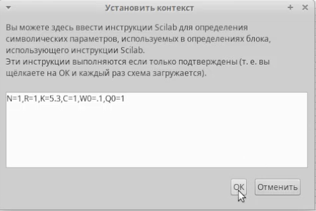{#fig:001 width=95%}

## Модель xcos 

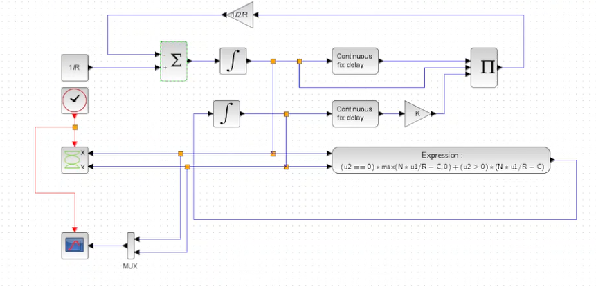{#fig:002 width=95%}

## Полученные графики 

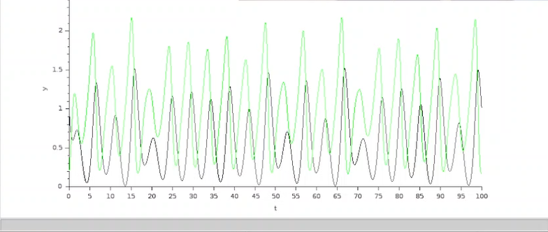{#fig:003 width=49%}
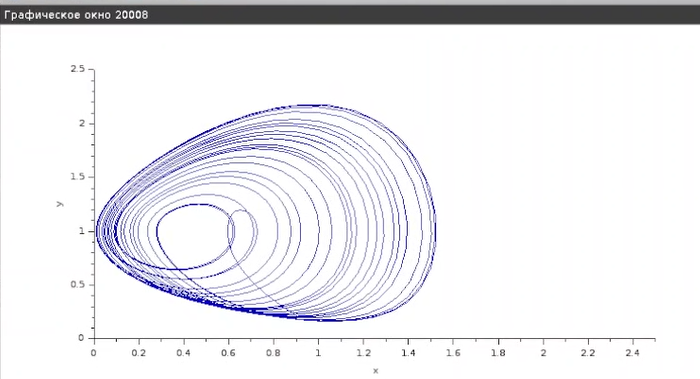{#fig:004 width=49%}

## Измененные параметры моделирования 

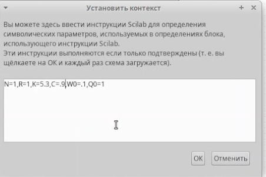{#fig:005 width=95%}

## Графики

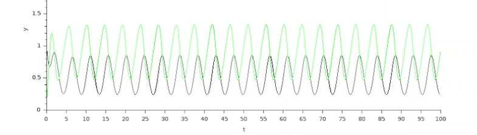{#fig:006 width=49%}
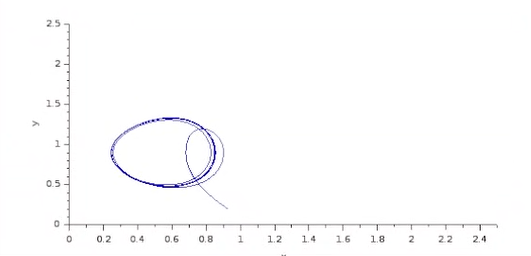{#fig:007 width=49%}

## Код реализации модели

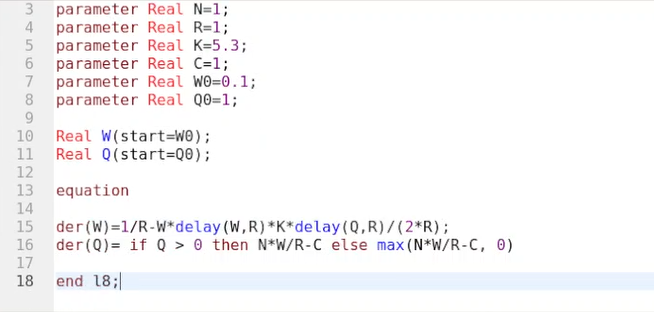{#fig:008 width=95%}

## Графики

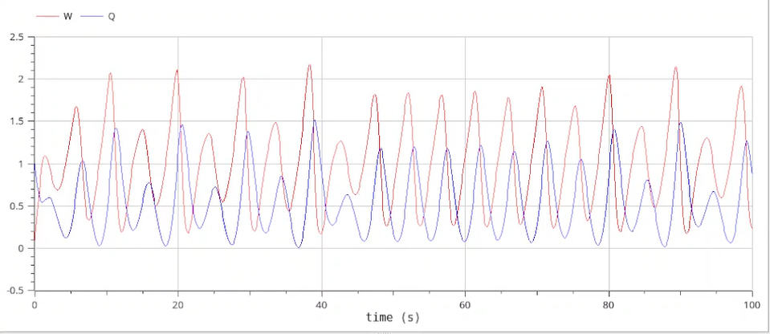{#fig:009 width=49%}
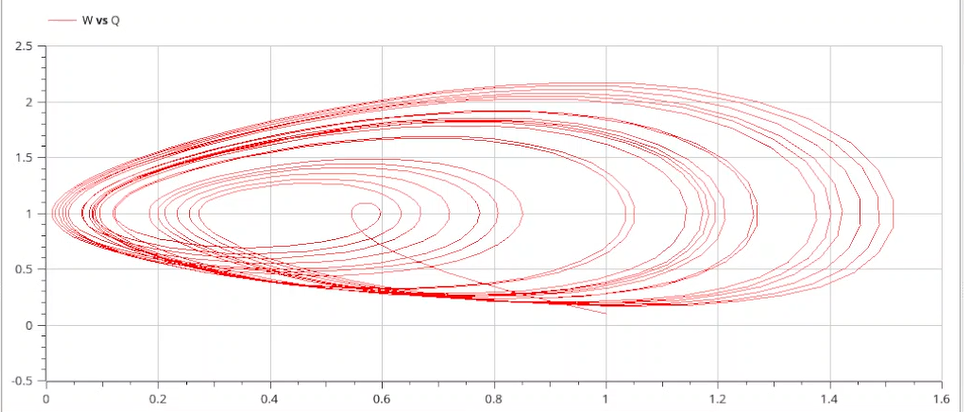{#fig:010 width=49%}

## Обновленный код реализации модели 

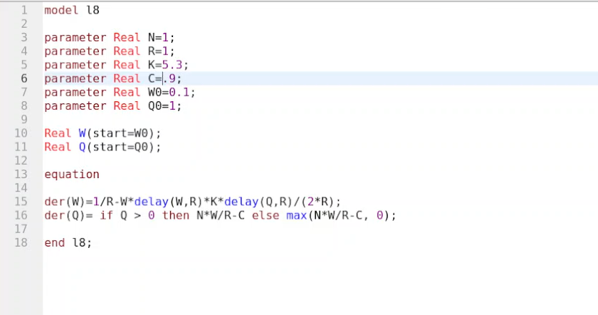{#fig:011 width=95%}

## Графики 

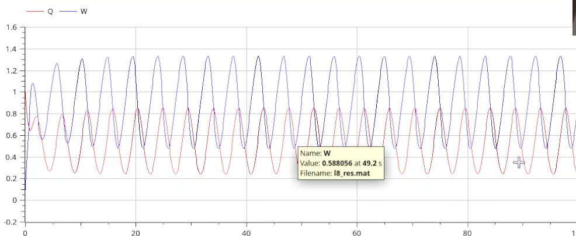{#fig:012 width=45%}
{#fig:013 width=45%}

## Выводы

В ходе выполнения данной лабораторной работы я ознакомился с моделью TCP/AQM и реализовал ее в xcos и OpenModelica.

