---
## Front matter
title: "Лабораторная работа №8"
subtitle: "Имитационное моделирование"
author: "Волгин Иван Алексеевич"

## Generic otions
lang: ru-RU
toc-title: "Содержание"

## Bibliography
bibliography: bib/cite.bib
csl: pandoc/csl/gost-r-7-0-5-2008-numeric.csl

## Pdf output format
toc: true # Table of contents
toc-depth: 2
lof: true # List of figures
lot: false # List of tables
fontsize: 12pt
linestretch: 1.5
papersize: a4
documentclass: scrreprt
## I18n polyglossia
polyglossia-lang:
  name: russian
  options:
	- spelling=modern
	- babelshorthands=true
polyglossia-otherlangs:
  name: english
## I18n babel
babel-lang: russian
babel-otherlangs: english
## Fonts
mainfont: IBM Plex Serif
romanfont: IBM Plex Serif
sansfont: IBM Plex Sans
monofont: IBM Plex Mono
mathfont: STIX Two Math
mainfontoptions: Ligatures=Common,Ligatures=TeX,Scale=0.94
romanfontoptions: Ligatures=Common,Ligatures=TeX,Scale=0.94
sansfontoptions: Ligatures=Common,Ligatures=TeX,Scale=MatchLowercase,Scale=0.94
monofontoptions: Scale=MatchLowercase,Scale=0.94,FakeStretch=0.9
mathfontoptions:
## Biblatex
biblatex: true
biblio-style: "gost-numeric"
biblatexoptions:
  - parentracker=true
  - backend=biber
  - hyperref=auto
  - language=auto
  - autolang=other*
  - citestyle=gost-numeric
## Pandoc-crossref LaTeX customization
figureTitle: "Рис."
tableTitle: "Таблица"
listingTitle: "Листинг"
lofTitle: "Список иллюстраций"
lotTitle: "Список таблиц"
lolTitle: "Листинги"
## Misc options
indent: true
header-includes:
  - \usepackage{indentfirst}
  - \usepackage{float} # keep figures where there are in the text
  - \floatplacement{figure}{H} # keep figures where there are in the text
---

# Цель работы

Изучить математическую модель TCP/AQM и построить ее в xcos и OpenModelica

# Задание

1. Построить модель в xcos
2. Построить модель в OpenModelica

# Выполнение лабораторной работы

Первым этапом я построил модель в xcos, для этого сначала нужно было задать параметры моделирования (рис. [-@fig:001]). 

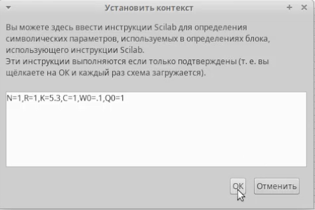{#fig:001 width=70%}

Далее я построил саму модель по примеру из файла с описанием лабораторной (рис. [-@fig:002]). 

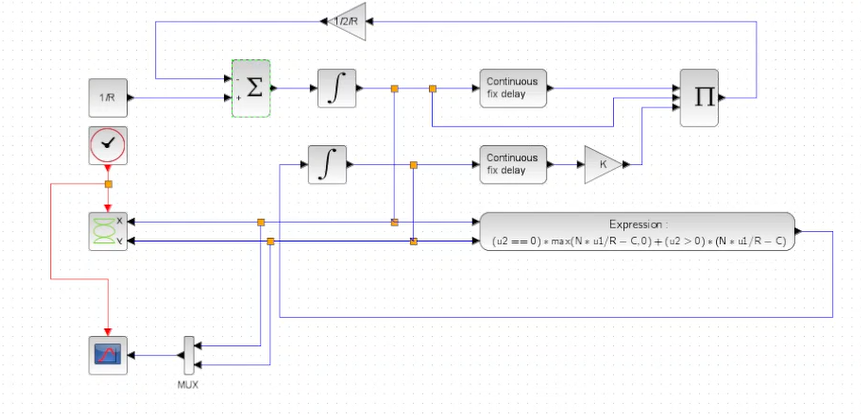{#fig:002 width=70%}

В итоге я получил такие графики (рис. [-@fig:003]) (рис. [-@fig:004]).

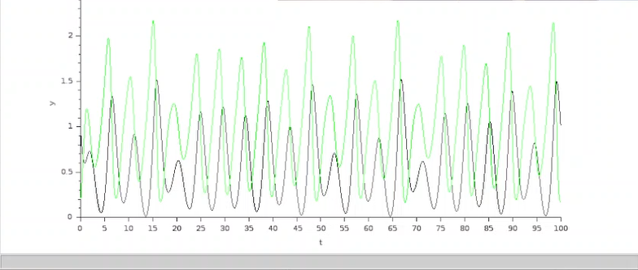{#fig:003 width=70%}

{#fig:004 width=70%}

Далее нужно было поменять параметр C с 1 на 0.9, что я и сделал (рис. [-@fig:005]). 

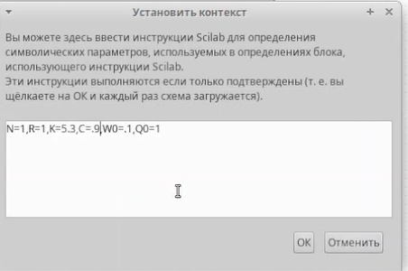{#fig:005 width=70%}

Получил такие результаты (рис. [-@fig:006]) (рис. [-@fig:007]).

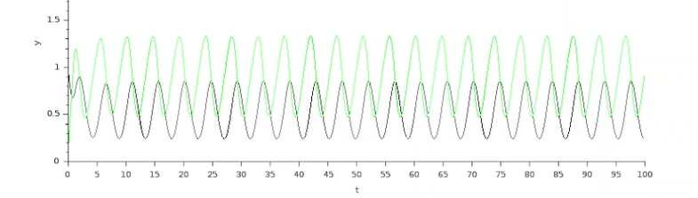{#fig:006 width=70%}

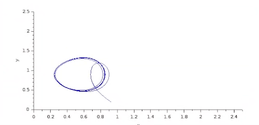{#fig:007 width=70%}

Вторым этапом я нужно было построить модель в OpenModelica и сравнить результаты с предыдущими. Я написал код реализации модели TCP/AQM (рис. [-@fig:008]). 

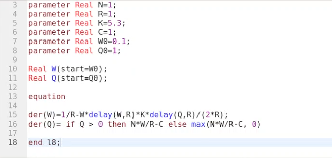{#fig:008 width=70%}

Далее я его скомпилировал и получил следующие результаты (рис. [-@fig:009]) (рис. [-@fig:010]), которые совпали с ранее полученными при соответствующих параметрах. 

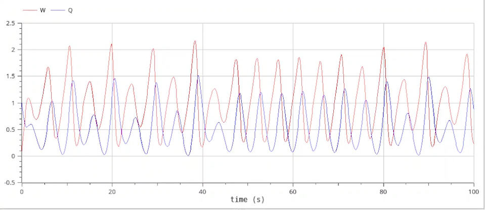{#fig:009 width=70%}

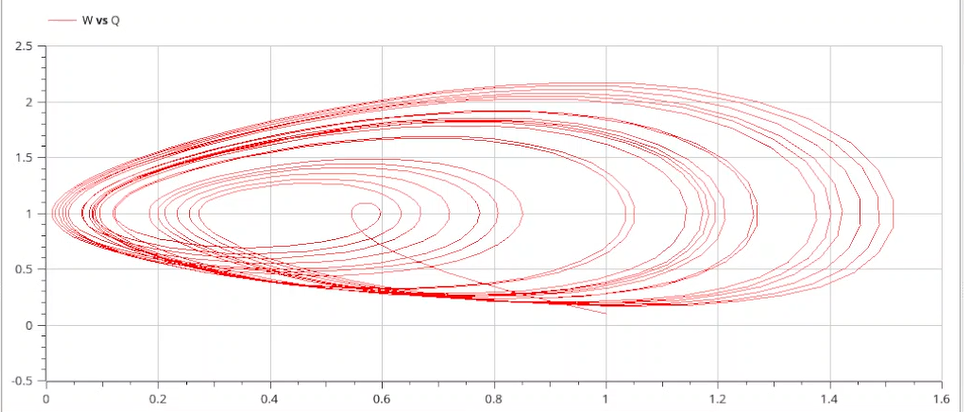{#fig:010 width=70%}

Как и на прошлом этапе, далее я поменял значение параметра C на 0.9 (рис. [-@fig:011]). 

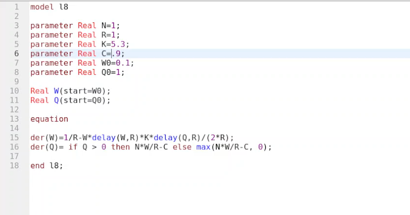{#fig:011 width=70%}

После этого скомпилировал новую версию кода и получил графики, которые тоже совпали в соответствующими графиками с прошлого этапа (рис. [-@fig:012]) (рис. [-@fig:013]).

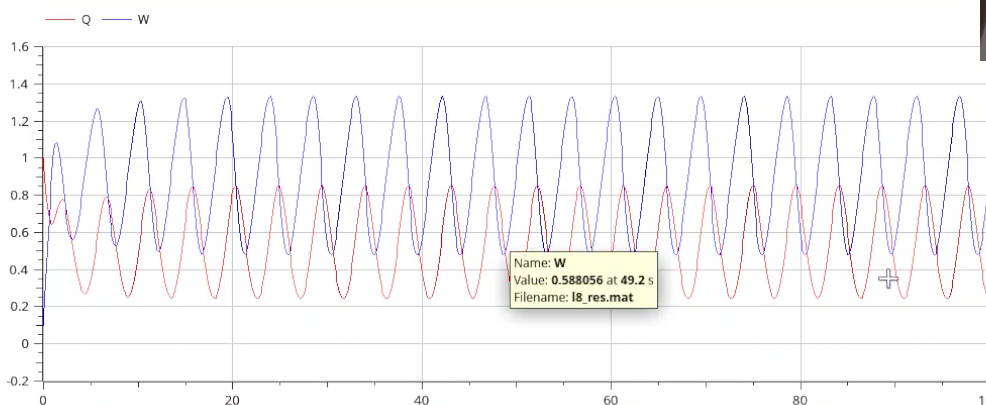{#fig:012 width=70%}

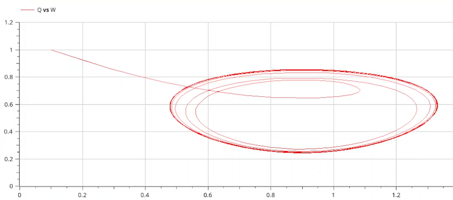{#fig:013 width=70%}

# Выводы

В ходе выполнения данной лабораторной работы я ознакомился с моделью TCP/AQM и реализовал ее в xcos и OpenModelica.

