---
## Front matter
lang: ru-RU
title: Упражнение xcos
subtitle: Имитационное моделирование
author:
  - Волгин И. А.
institute:
  - Российский университет дружбы народов, Москва, Россия
date: 08 марта 2025

## i18n babel
babel-lang: russian
babel-otherlangs: english

## Formatting pdf
toc: false
toc-title: Содержание
slide_level: 2
aspectratio: 169
section-titles: true
theme: metropolis
header-includes:
 - \metroset{progressbar=frametitle,sectionpage=progressbar,numbering=fraction}
---

# Информация

## Докладчик

:::::::::::::: {.columns align=center}
::: {.column width="99%"}

  * Волгин Иван Алексеевич
  * Студент группы НФИбд-01-22
  * Российский университет дружбы народов

:::
::::::::::::::

# Выполнение упражнения

## настройка блоков

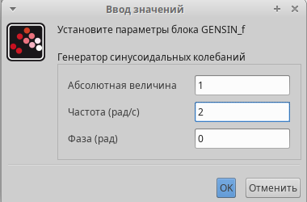{#fig:001 width=45%}
{#fig:002 width=45%}

## фигуры Лиссажу с A = B = 1, a = 1, b = 2  

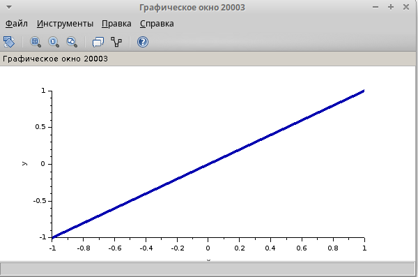{#fig:003 width=32%}
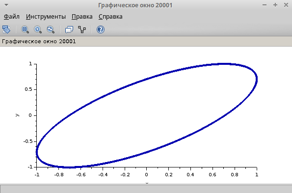{#fig:004 width=32%}
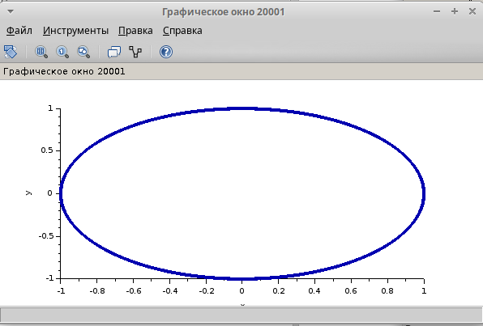{#fig:005 width=32%}

## Фигуры Лиссажу с A = B = 1, a = 1, b = 2

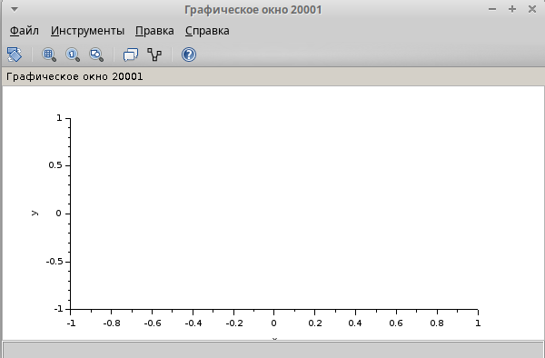{#fig:006 width=45%}
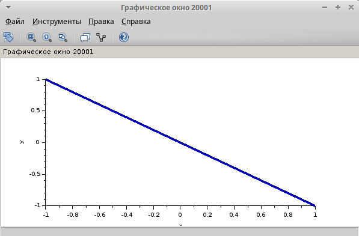{#fig:007 width=45%}

## Фигуры Лиссажу А = B = 1, a = 2, b = 4

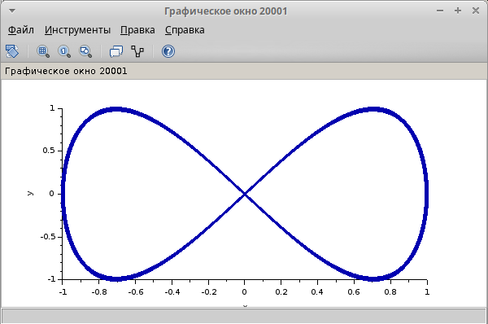{#fig:008 width=32%}
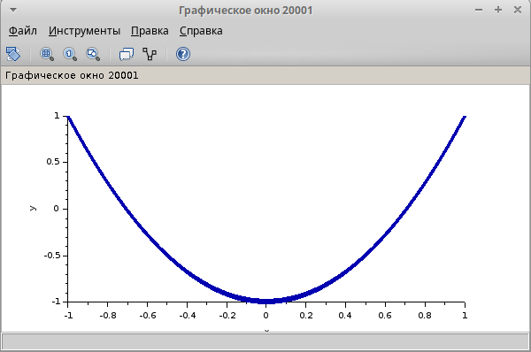{#fig:009 width=32%}
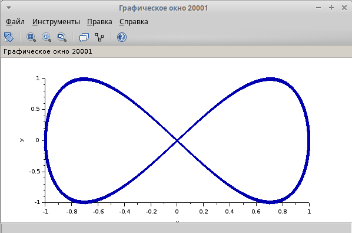{#fig:010 width=32%}

## Фигуры Лиссажу А = B = 1, a = 2, b = 4

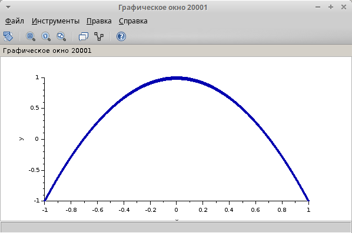{#fig:011 width=45%}
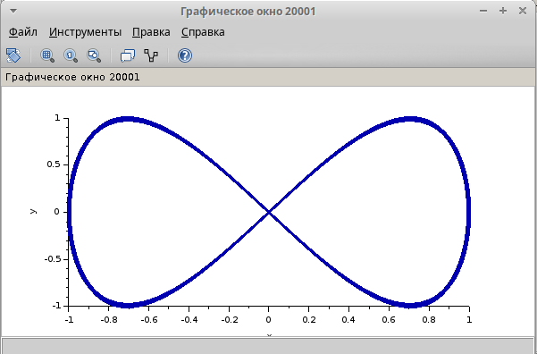{#fig:012 width=45%}

## Фигуры Лиссажу A = B = 1, a = 2, b = 6

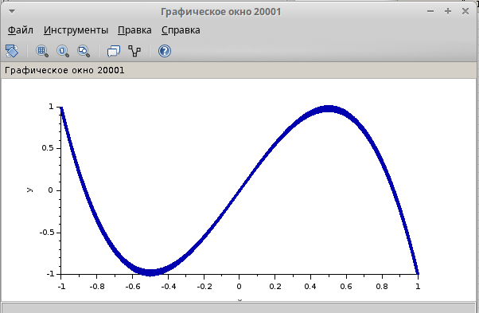{#fig:013 width=32%}
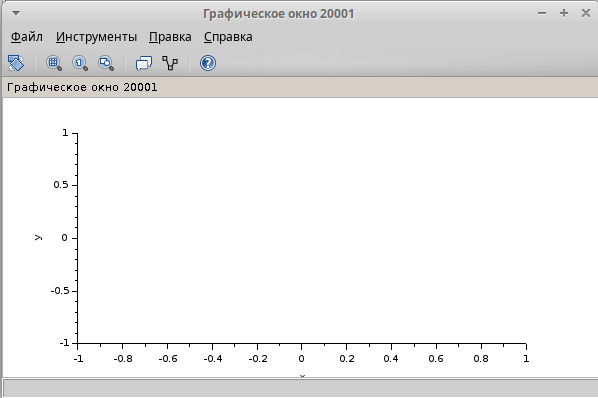{#fig:014 width=32%}
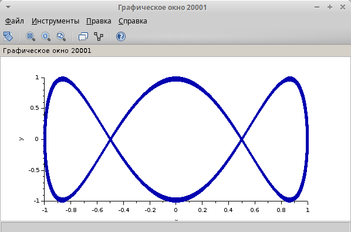{#fig:015 width=32%}

## Фигуры Лиссажу A = B = 1, a = 2, b = 6

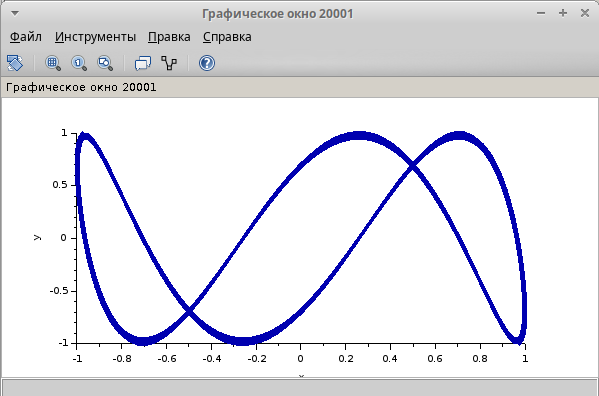{#fig:016 width=45%}
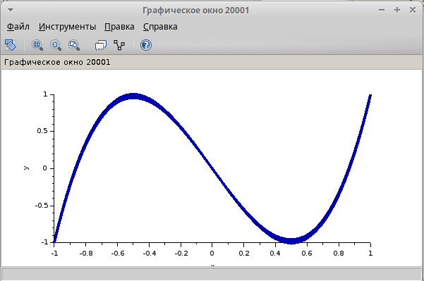{#fig:017 width=45%}

## Фигуры Лиссажу A = B = 1, a = 2, b = 3

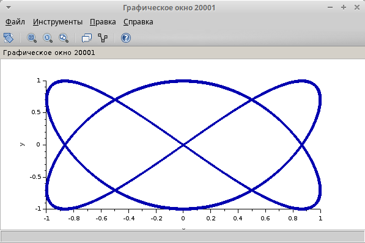{#fig:018 width=32%}
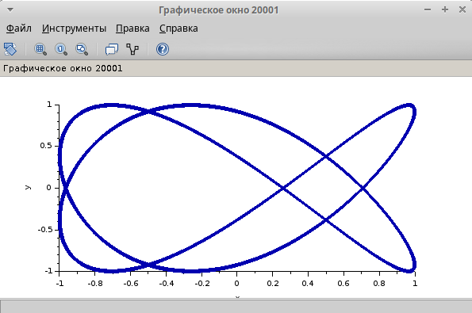{#fig:019 width=32%}
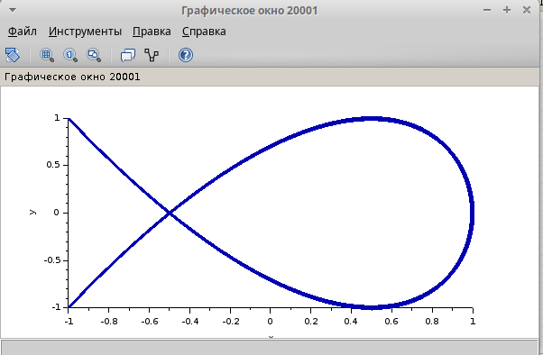{#fig:020 width=32%}

## Фигуры Лиссажу A = B = 1, a = 2, b = 3

{#fig:021 width=45%}
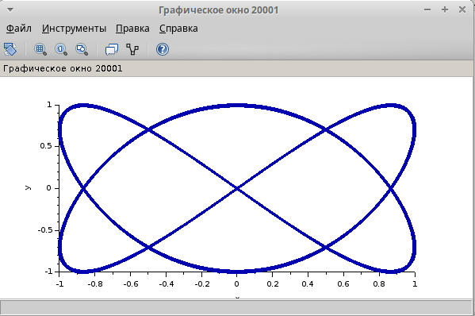{#fig:022 width=45%}

## Выводы

В ходе выполнения данного упражнения я воспользовался программой Scilab и научился использовать ее инструмент визуализации xcos

