---
## Front matter
title: "Упражнение xcos"
subtitle: "Имитационное моедлирование"
author: "Волгин Иван Алексеевич"

## Generic otions
lang: ru-RU
toc-title: "Содержание"

## Bibliography
bibliography: bib/cite.bib
csl: pandoc/csl/gost-r-7-0-5-2008-numeric.csl

## Pdf output format
toc: true # Table of contents
toc-depth: 2
lof: true # List of figures
lot: false # List of tables
fontsize: 12pt
linestretch: 1.5
papersize: a4
documentclass: scrreprt
## I18n polyglossia
polyglossia-lang:
  name: russian
  options:
	- spelling=modern
	- babelshorthands=true
polyglossia-otherlangs:
  name: english
## I18n babel
babel-lang: russian
babel-otherlangs: english
## Fonts
mainfont: IBM Plex Serif
romanfont: IBM Plex Serif
sansfont: IBM Plex Sans
monofont: IBM Plex Mono
mathfont: STIX Two Math
mainfontoptions: Ligatures=Common,Ligatures=TeX,Scale=0.94
romanfontoptions: Ligatures=Common,Ligatures=TeX,Scale=0.94
sansfontoptions: Ligatures=Common,Ligatures=TeX,Scale=MatchLowercase,Scale=0.94
monofontoptions: Scale=MatchLowercase,Scale=0.94,FakeStretch=0.9
mathfontoptions:
## Biblatex
biblatex: true
biblio-style: "gost-numeric"
biblatexoptions:
  - parentracker=true
  - backend=biber
  - hyperref=auto
  - language=auto
  - autolang=other*
  - citestyle=gost-numeric
## Pandoc-crossref LaTeX customization
figureTitle: "Рис."
tableTitle: "Таблица"
listingTitle: "Листинг"
lofTitle: "Список иллюстраций"
lotTitle: "Список таблиц"
lolTitle: "Листинги"
## Misc options
indent: true
header-includes:
  - \usepackage{indentfirst}
  - \usepackage{float} # keep figures where there are in the text
  - \floatplacement{figure}{H} # keep figures where there are in the text
---

# Цель работы

Построить в приложении Scilab фигуры Лиссажу используя инструмент xcos

# Задание

Постройте с помощью xcos фигуры Лиссажу со следующими параметрами:
1) A = B = 1, a = 2, b = 2, δ = 0; π/4; π/2; 3π/4; π;
2) A = B = 1, a = 2, b = 4, δ = 0; π/4; π/2; 3π/4; π;
3) A = B = 1, a = 2, b = 6, δ = 0; π/4; π/2; 3π/4; π;
4) A = B = 1, a = 2, b = 3, δ = 0; π/4; π/2; 3π/4; π.

# Выполнение лабораторной работы

Для начала я настраиваю объекты. выставляю параметры блока синусоидальных колебаний (рис. [-@fig:001]) и парамеры окна (рис. [-@fig:002]).

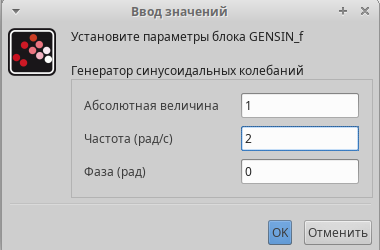{#fig:001 width=70%}

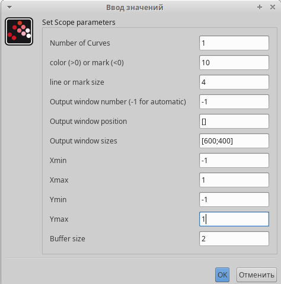{#fig:002 width=70%}

Параметры настройки кривых Лиссажу: A, B — амплитуды колебаний, a, b — частоты, δ — сдвиг фаз.
Далее приступаем к заданию и строим фигуры Лиссажу с A = B = 1, a = 1, b = 2 (рис. [-@fig:003]), (рис. [-@fig:004]), (рис. [-@fig:005]), (рис. [-@fig:006]), (рис. [-@fig:007])

{#fig:003 width=70%}

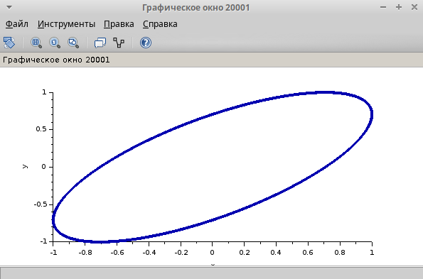{#fig:004 width=70%}

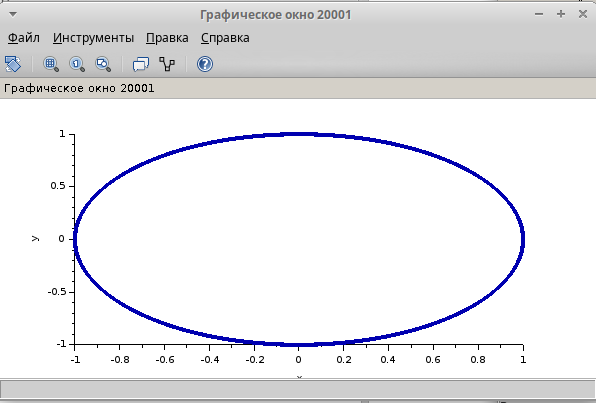{#fig:005 width=70%}

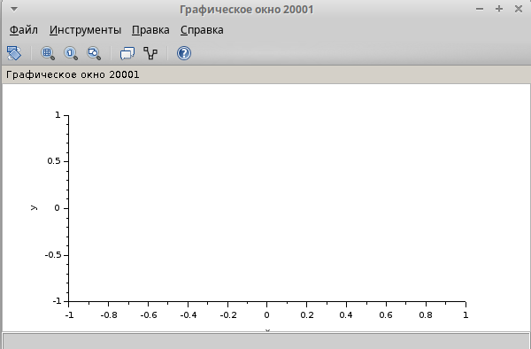{#fig:006 width=70%}

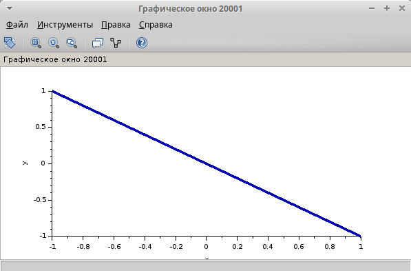{#fig:007 width=70%}

Далее преходим к следующем пункту, где нужно было поменят параметр частоты одного из блоков синусоидальных колебаний на 4. A = B = 1, a = 2, b = 4 (рис. [-@fig:008]), (рис. [-@fig:009]), (рис. [-@fig:010]), (рис. [-@fig:011]), (рис. [-@fig:012])

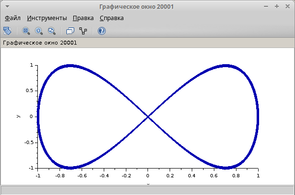{#fig:008 width=70%}

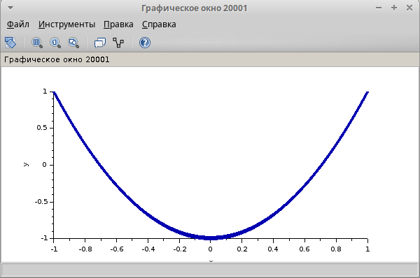{#fig:009 width=70%}

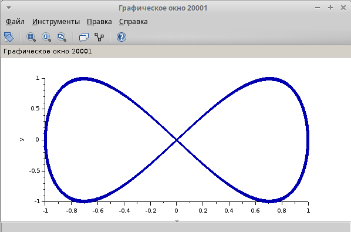{#fig:010 width=70%}

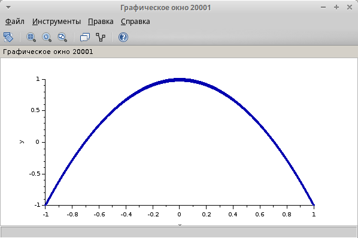{#fig:011 width=70%}

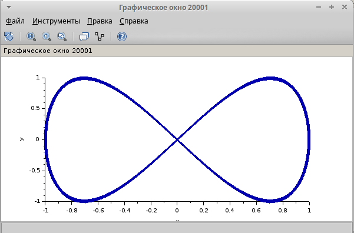{#fig:012 width=70%}

Затем снова меняем параметр частоты того же блока, но уже на значение 6. A = B = 1, a = 2, b = 6 (рис. [-@fig:013]), (рис. [-@fig:014]), (рис. [-@fig:015]), (рис. [-@fig:016]), (рис. [-@fig:017])

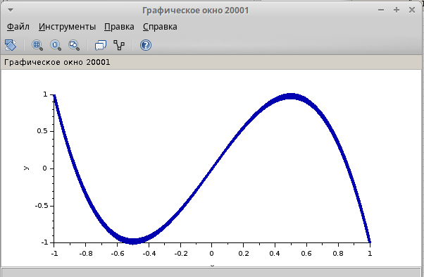{#fig:013 width=70%}

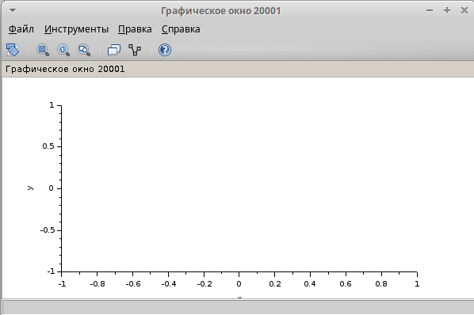{#fig:014 width=70%}

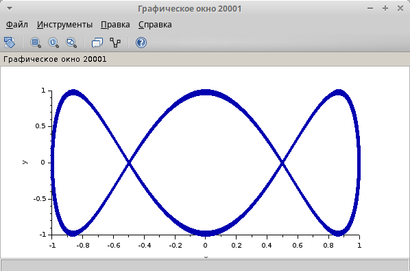{#fig:015 width=70%}

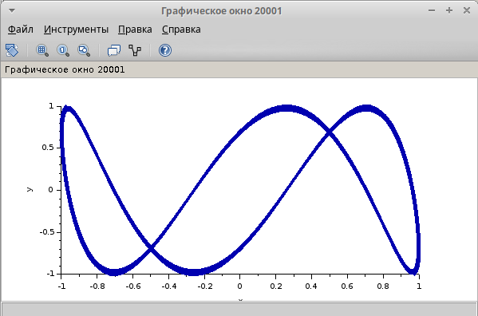{#fig:016 width=70%}

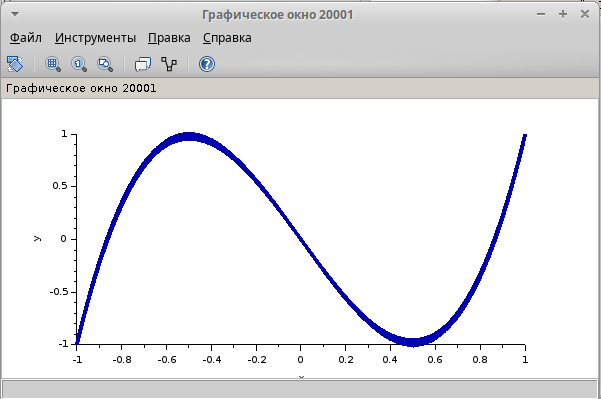{#fig:017 width=70%}

В последнем пункте нужно было вновь изменить параметр частоты блока синусоидальных колеьаний, теперь берем значение 3. A = B = 1, a = 2, b = 3 рис. [-@fig:018]), (рис. [-@fig:019]), (рис. [-@fig:020]), (рис. [-@fig:021]), (рис. [-@fig:022])

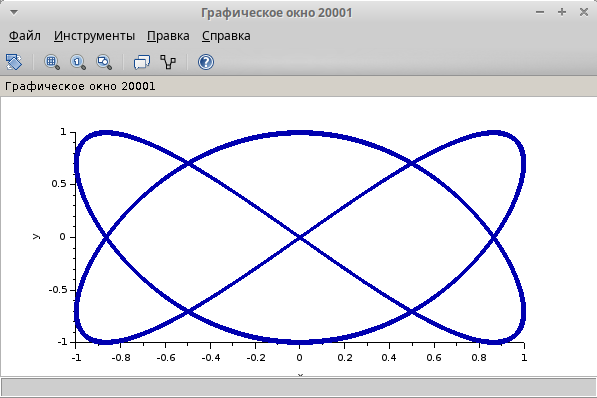{#fig:018 width=70%}

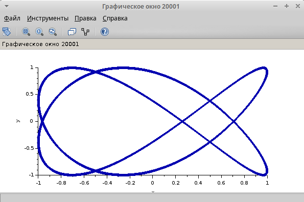{#fig:019 width=70%}

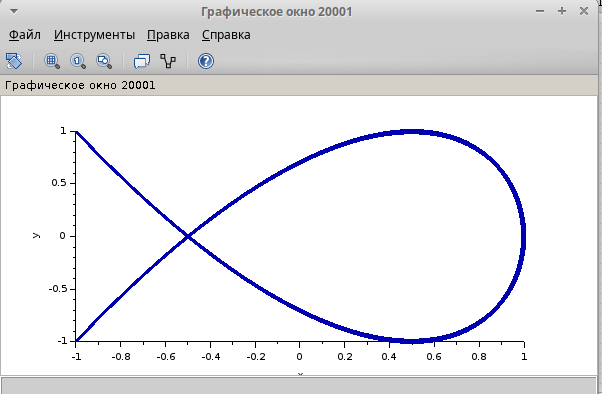{#fig:020 width=70%}

{#fig:021 width=70%}

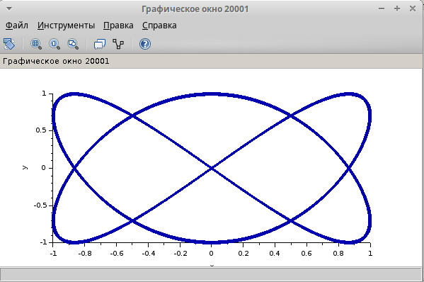{#fig:022 width=70%}

# Выводы

В ходе выполнения данного упражнения я воспользовался программой Scilab и научился использовать ее инструмент визуализации xcos

